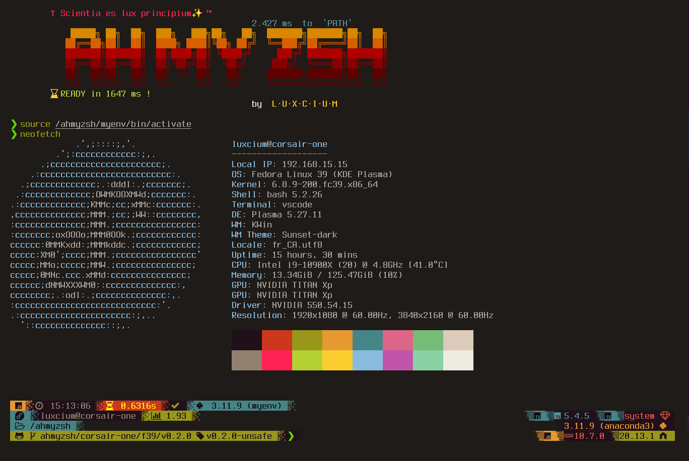
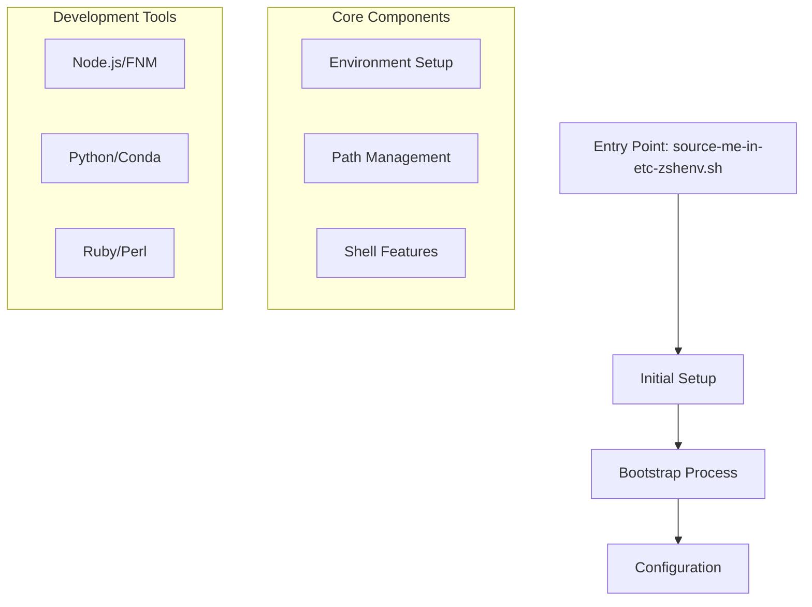

# ahmyzsh



## System Overview

AHMYZSH is a sophisticated shell configuration system providing:

1. Performance-Optimized Shell Environment
   - Smart path caching
   - Timed execution monitoring
   - Conditional component loading

2. Modular Configuration Management
   - Hierarchical file loading
   - Selective component initialization
   - Extensive function library

3. Development Environment Integration
   - Node.js version management (FNM)
   - Python/Conda support
   - Ruby/Perl configurations
   - Development tool integration

## System Architecture



## Key Components

### 1. File Organization

- `/core/`: Core system functionality
  - `compute-path/`: Path computation and caching
  - `functions/`: Shell function libraries
  - `aliases/`: Command aliases
  - `options/`: Shell options

### 2. Configuration Files

- `source-me-in-etc-zshenv.sh`: Main entry point
- `MAIN.sh`: Bootstrap system
- `MAIN-FUNCTIONS.sh`: Core functions
- `MAIN_SETTINGS.sh`: System settings

### 3. Primary Functions

- Configuration Loading:
  - `load_all_config_and_settings_files()`
  - `load_config_or_settings_()`
  - `Load_all_files_d()`

- Performance Monitoring:
  - `timer_()`: Base timing
  - `timer_now()`: Current timing
  - `timer_all()`: Global timing

- File Operations:
  - `load_()`: Smart loading
  - `source_()`: Safe sourcing
  - `call_()`: Timed execution

## Usage Notes

### Branch Organization

- `luxcium`: macOS configuration
- `pc-master-race`: WSL/Windows setup
- `fedora-working-station`: Fedora development

### Hidden Components

Configuration for hidden folders in `.vscode/settings.json`:

```json
{
  "files.exclude": {
    "**/*.zwc": true,
    "powerlevel10k": true,
    "ohmyzsh": true,
    "powerline": true,
    "crt-profiles": true,
    "node_modules": true
  }
}
```

## Important Notices

### Personal Use Notice

This project is maintained for personal use and may not be suitable for general purposes. While you're welcome to use and adapt it, it comes with no guarantees of fitness for any particular purpose.

### Security Warning

⚠️ **IMPORTANT**: Audit all files before use. Report security issues at [AHMYZSH Issues](https://github.com/Luxcium/ahmyzsh/issues)

### Usage Rights

Feel free to use components in personal or open source projects under these conditions:

- Include notice: `Copyright © 2019-present Benjamin Vincent Kasapoglu (Luxcium)`
- Document modifications from original work
- Comply with MIT/Mozilla Public License v2.0 as applicable

## Contributing

1. Report Issues
   - Open an [issue](https://github.com/Luxcium/ahmyzsh/issues) describing the problem
   - Include relevant system information and steps to reproduce

2. Submit Fixes
   - Create pull requests for bug fixes
   - Address compatibility issues
   - Improve documentation

## License

MIT License

Copyright © 2019-2020 Benjamin Vincent Kasapoglu (Luxcium) and contributors
(<https://github.com/Luxcium/ahmyzsh/contributors>)

Permission is hereby granted, free of charge, to any person obtaining a copy
of this software and associated documentation files (the "Software"), to deal
in the Software without restriction, including without limitation the rights
to use, copy, modify, merge, publish, distribute, sublicense, and/or sell
copies of the Software, and to permit persons to whom the Software is
furnished to do so, subject to the following conditions:

The above copyright notice and this permission notice shall be included in all
copies or substantial portions of the Software.

THE SOFTWARE IS PROVIDED "AS IS", WITHOUT WARRANTY OF ANY KIND, EXPRESS OR
IMPLIED, INCLUDING BUT NOT LIMITED TO THE WARRANTIES OF MERCHANTABILITY,
FITNESS FOR A PARTICULAR PURPOSE AND NONINFRINGEMENT. IN NO EVENT SHALL THE
AUTHORS OR COPYRIGHT HOLDERS BE LIABLE FOR ANY CLAIM, DAMAGES OR OTHER
LIABILITY, WHETHER IN AN ACTION OF CONTRACT, TORT OR OTHERWISE, ARISING FROM,
OUT OF OR IN CONNECTION WITH THE SOFTWARE OR THE USE OR OTHER DEALINGS IN THE
SOFTWARE.
