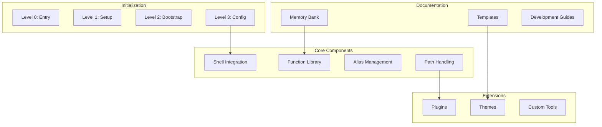

# AHMYZSH

## System Architecture



## Overview

AHMYZSH is a comprehensive shell configuration framework designed for performance, extensibility, and maintainability.

### Key Features

- Layered initialization system
- Performance-optimized shell integration
- Comprehensive alias management
- Dynamic path handling
- Plugin architecture
- Theme customization

## Project Structure


### Core Components

- `core/` - Essential shell functionality
- `plugins/` - Extensible feature modules
- `themes/` - Visual customization
- `templates/` - Configuration templates
- `memory-bank/` - Project documentation
- `custom-tmux/` - Terminal multiplexer integration
- `documentation/` - User and development guides

## Documentation Strategy

### 1. Memory Bank

- `projectbrief.md` - Project overview and goals
- `productContext.md` - Use cases and requirements
- `systemPatterns.md` - Architecture and patterns
- `techContext.md` - Technical specifications
- `activeContext.md` - Current development state
- `progress.md` - Implementation tracking

### 2. Templates

Located in `/templates`:

- Analysis frameworks
- Configuration templates
- Development tools
- Integration guides

### 3. Development Guidelines

Found in `/documentation`:

- Contribution workflow
- Testing procedures
- Performance standards
- Style guidelines

## Getting Started

### 1. System Requirements

- Zsh shell environment
- Git for version control
- Terminal with Unicode support
- Optional: tmux for enhanced terminal capabilities

### 2. Installation

1. Clone the repository:

   ```bash
   git clone [repository-url]
   ```

2. Run the installation script:

   ```bash
   ./source-me-in-etc-zshenv.sh
   ```

3. Configure your environment:
   - Copy relevant templates
   - Set up your preferences
   - Choose your theme

### 3. Configuration

1. System-level setup:
   - Environment variables
   - Path configuration
   - Security settings

2. User customization:
   - Personal aliases
   - Custom functions
   - Theme selection

## Development

### Contributing

1. Fork the repository
2. Create a feature branch
3. Follow coding standards
4. Submit pull request

### Testing

- Unit tests for functions
- Integration tests for components
- Performance benchmarks
- Documentation coverage

## Performance

AHMYZSH emphasizes performance through:

### Optimization Strategies

- Lazy loading of components
- Efficient initialization
- Minimal dependencies
- Cached operations

### Monitoring Tools

- Built-in benchmarks
- Performance profiling
- Resource monitoring
- Optimization templates

## Support

- Documentation: See `/documentation`
- Templates: See `/templates`
- Development: See `DEVELOPMENT.md`
- User Guide: See `USER_GUIDE.md`
