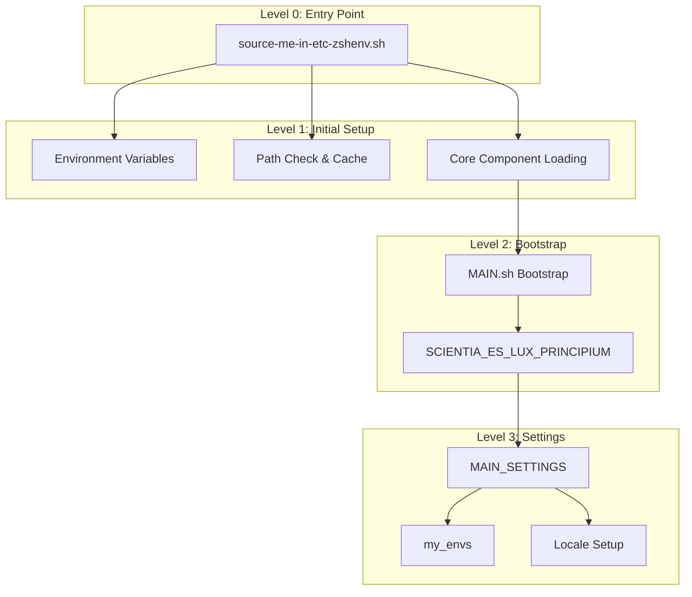

# AHMYZSH Development Guide

## Architecture Overview

### Initialization Sequence



## Core Function Library

### Configuration Management

1. `load_all_config_and_settings_files()`
   - Purpose: Master configuration loader
   - Usage: Called during initialization
   - Dependencies: Requires AHMYZSH path setup

2. `load_config_or_settings_()`
   - Purpose: Directory-specific loader
   - Usage: Called by master loader
   - Dependencies: Valid directory path

3. `Load_all_files_d()`
   - Purpose: Bulk .sh file loading
   - Usage: Directory processing
   - Dependencies: Directory read permissions

### Performance Monitoring

1. `timer_()`
   - Purpose: Base timing calculations
   - Usage: Foundation for timing system
   - Dependencies: None

2. `timer_now()`
   - Purpose: Current execution timing
   - Usage: Immediate timing needs
   - Dependencies: timer_()

3. `timer_from_then()`
   - Purpose: Custom interval timing
   - Usage: Specific duration tracking
   - Dependencies: timer_()

### File Operations

1. `load_()`
   - Purpose: Smart file loading
   - Usage: `load_ "file" "function"`
   - Dependencies: source_(), call_()

2. `source_()`
   - Purpose: Safe file sourcing
   - Usage: `source_ "file"`
   - Dependencies: File permissions

3. `call_()`
   - Purpose: Timed function execution
   - Usage: `call_ function_name`
   - Dependencies: timer_()

## Development Workflow

### 1. Adding New Features


1. Branch Creation
   - Use environment-specific base branch
   - Follow naming convention: feature/description

2. Implementation
   - Follow existing patterns
   - Maintain performance focus
   - Add timing checks if needed

3. Testing
   - Verify in target environment
   - Check startup performance
   - Validate dependencies

### 2. Function Development

```bash
# Function Template
function new_function() {
    local start_time=$(/usr/bin/date +%s%N)

    # Function logic here

    if [ "$VERBOSA" = "1" ]; then
        timer_ "${start_time}" "new_function"
    fi
}
```

### 3. Path Management

```bash
# Path Cache Management
function update_path_cache() {
    local cache_file="${AHMYZSH_CACHE}/path.env"
    local temp_file="${cache_file}.tmp"

    # Generate new path
    compute_path > "${temp_file}"

    # Atomic update
    mv "${temp_file}" "${cache_file}"
}
```

## Testing Guidelines

### 1. Performance Testing

```bash
# Timing Template
function test_performance() {
    local start_time=$(/usr/bin/date +%s%N)

    # Test operations

    timer_ "${start_time}" "test_name"
}
```

### 2. Function Testing

```bash
# Test Framework
function run_tests() {
    local tests_passed=0
    local tests_failed=0

    # Test cases
    test_case && ((tests_passed++)) || ((tests_failed++))

    echo "Passed: ${tests_passed}, Failed: ${tests_failed}"
}
```

## Branch Management

### Environment-Specific Branches

1. `luxcium` (macOS)
   - Apple-specific optimizations
   - MacPorts/Homebrew support
   - macOS path handling

2. `pc-master-race` (WSL/Windows)
   - WSL compatibility
   - Windows path integration
   - Performance tuning

3. `fedora-working-station` (Fedora)
   - Linux optimization
   - System integration
   - Package management

### Merge Strategy

1. Feature Development
   - Develop in feature branches
   - Test in target environment
   - Merge to environment branch

2. Cross-Environment Features
   - Develop in separate branch
   - Test in all environments
   - Merge to each environment branch

## Documentation Standards

### 1. Function Documentation

```bash
# Function documentation template
#+ --------------------------------------
#? @function: function_name
#? @description: What the function does
#? @param: $1 - description
#? @return: description
#? @dependencies: list of dependencies
#+ --------------------------------------
```

### 2. File Headers

```bash
#!/usr/bin/env bash
#& Scientia es lux principium
#+ =============================================================================≈
#? @file: filename
#? @purpose: file purpose
#? @author: author name
#? @copyright: copyright info
#? @license: MIT
#+ =============================================================================≈
```

## Performance Considerations

1. Path Management
   - Use caching when possible
   - Minimize path computation
   - Optimize path updates

2. Function Loading
   - Lazy loading when appropriate
   - Cache frequently used functions
   - Monitor load times

3. Resource Usage
   - Minimize subshell usage
   - Use built-in commands when possible
   - Monitor memory consumption
