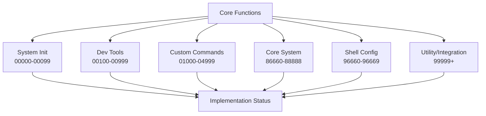
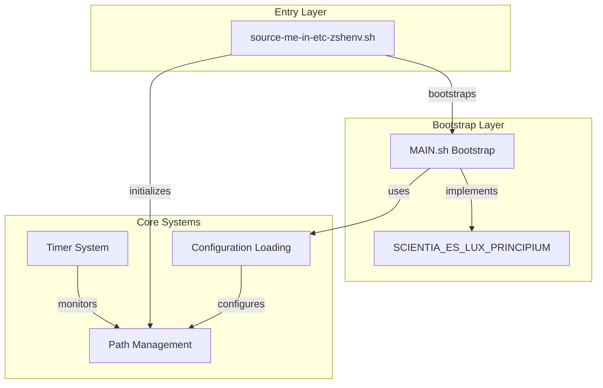

# Active Context

## Current Focus: Core Functions Documentation and Completion

We have completed a comprehensive documentation of all functions in the core/functions directory. This involved:

1. Systematic audit of all 52 .sh files
2. Documentation of function purpose, features, and dependencies
3. Identification of incomplete functions and missing functionality
4. Creation of a detailed README.md with implementation status

### Implementation Tracking Structure

### Function Implementation Status Board

| Category | Total Files | Complete | Partially Complete | Incomplete | Notes |
|----------|-------------|----------|-------------------|------------|-------|
| System Init | 5 | 4 | 0 | 1 | Strong foundation, one incomplete file |
| Dev Tools | 4 | 4 | 0 | 0 | All files complete with minor improvements needed |
| Custom Commands | 9 | 6 | 2 | 1 | Good coverage, some partial implementations |
| Profile Management | 2 | 1 | 0 | 1 | One file is just a placeholder |
| Core System | 9 | 7 | 2 | 0 | Strong core system with minor gaps |
| Shell Config | 7 | 6 | 1 | 0 | Comprehensive ZSH configuration |
| Utility/Integration | 2 | 2 | 0 | 0 | Complete utility functions |
| **TOTAL** | **38** | **30** | **5** | **3** | **78.9% complete, 13.2% partial, 7.9% incomplete** |

### Common Improvement Areas

1. **Error Handling**: Most functions need improved error detection and reporting
2. **Documentation**: Many functions need better documentation of dependencies
3. **Configuration**: Many functions would benefit from configurable options
4. **Validation**: Input and dependency validation is often missing
5. **Consolidation**: Several functions have duplicate or similar functionality

## Implementation Strategy

### Priority Order

1. System Initialization (00000-00099)
   - Critical for system bootstrap
   - Core functionality dependencies

2. Core System Functions (86660-88888)
   - Essential system operations
   - Required by other components

3. Shell Configuration (96660-96669)
   - Environment setup and management
   - User experience configuration

4. Development Tools (00100-00999)
   - Development workflow support
   - Integration capabilities

5. Custom Commands (01000-04999)
   - User-facing functionality
   - Quality of life improvements

6. Utility and Integration (99999+)
   - Supporting functionality
   - Optional enhancements

## System Architecture

### Core Components Relationship

### Function Relationships

1. Entry Point Functions
   - Environment variable initialization
   - Path caching management
   - Core component sourcing
   - Bootstrap process initiation

2. Core Utility Functions (MAIN-FUNCTIONS.sh)
   - load_(): Smart file loading with timing
   - call_(): Function execution with performance tracking
   - source_(): Safe file sourcing with validation
   - timer_*(): Performance monitoring suite

3. Bootstrap Functions (MAIN.sh)
   - SCIENTIA_ES_LUX_PRINCIPIUM: Main orchestrator
   - Environment state tracking
   - Interactive shell setup
   - Component initialization

## Performance Optimization

### Path Management System

- Implements caching mechanism for PATH
- Uses extended path computation
- Integrates with Conda environment
- Performance-tracked operations

### Timer System Implementation

- Global timing reference (TIMER_ALL_THEN)
- Function-level timing (timer_now)
- Custom interval timing (timer_from_then)
- Verbose mode performance logging

## Current Questions

1. Path Computation Details
   - Internal workings of path caching
   - Cache invalidation strategy
   - Performance impact measurements

2. Configuration Loading
   - Load order dependencies
   - Conditional loading logic
   - Error handling patterns

3. Environment State Management
   - State transition triggers
   - State validation mechanisms
   - Impact on feature availability

## Next Investigation Steps

1. Path System Analysis
   - Examine core/compute-path/path.sh implementation
   - Document caching mechanism
   - Map path computation flow

2. Timer System Deep Dive
   - Analyze performance impact
   - Document timing patterns
   - Identify optimization opportunities

3. Bootstrap Process Documentation
   - Map SCIENTIA_ES_LUX_PRINCIPIUM flow
   - Document state management
   - Analyze interactive features

4. Configuration System Review
   - Document loading patterns
   - Map file dependencies
   - Analyze error handling
