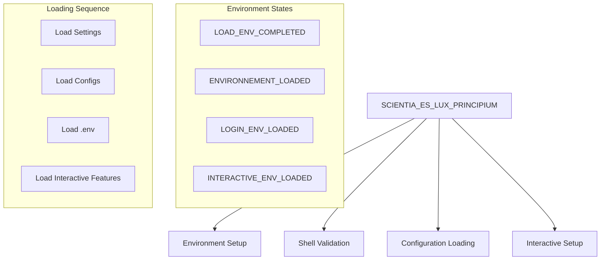

# Active Context

## Current Focus

Analyzing MAIN.sh bootstrap process and its interaction with core functions.

## Bootstrap Analysis

### SCIENTIA_ES_LUX_PRINCIPIUM Function

### Key Components

1. Environment State Tracking
   - LOAD_ENV_COMPLETED
   - ENVIRONNEMENT_LOADED
   - LOGIN_ENV_LOADED
   - INTERACTIVE_ENV_LOADED
   - Each has a corresponding "_ONCE" variant

2. Shell Validation
   - Checks for zsh shell
   - Prevents execution in non-zsh environments
   - Early return on validation failure

3. Loading Sequence
   - MAIN_SETTINGS.sh loading
   - Configuration and settings files
   - User's .env file
   - Interactive shell features (if interactive)

4. Interactive Features
   - Prompt activation
   - Oh My Zsh loading
   - Options configuration
   - Auto-suggestions
   - Auto-completion
   - Key bindings (vi mode)

## Function Dependencies

### Primary Functions Used

- load_(): Smart file loading
- call_(): Function execution with timing
- source_(): Safe file sourcing
- isinteractive(): Shell state check

### Key Calls Sequence

1. load_"${AHMYZSH}/MAIN_SETTINGS.sh"
2. call_load_all_config_and_settings_files
3. source_ "${HOME}/.env"
4. call_fnm_
5. call_activate_prompt (if interactive)
6. call_load_oh_my_zsh
7. call_load_options_list
8. call_load_options_main
9. call_load_autosuggest
10. call_load_autocomplete

## Current Questions

1. How does fnm_ function integrate?
2. What's in MAIN_SETTINGS.sh?
3. Details of load_oh_my_zsh implementation
4. Structure of options loading

## Next Investigation Steps

1. Examine MAIN_SETTINGS.sh content
2. Study Oh My Zsh integration
3. Analyze options and autocompletion setup
4. Document fnm_ function role
