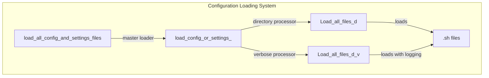
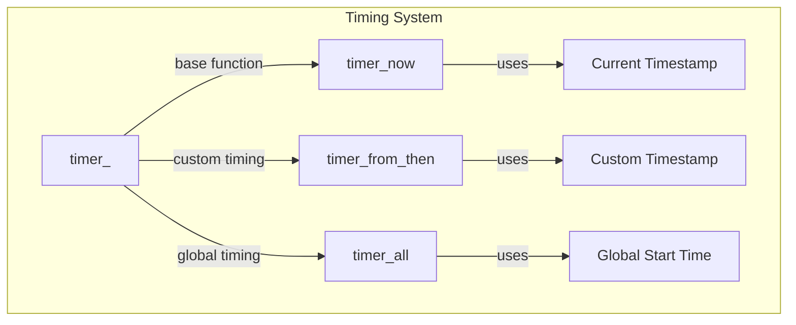
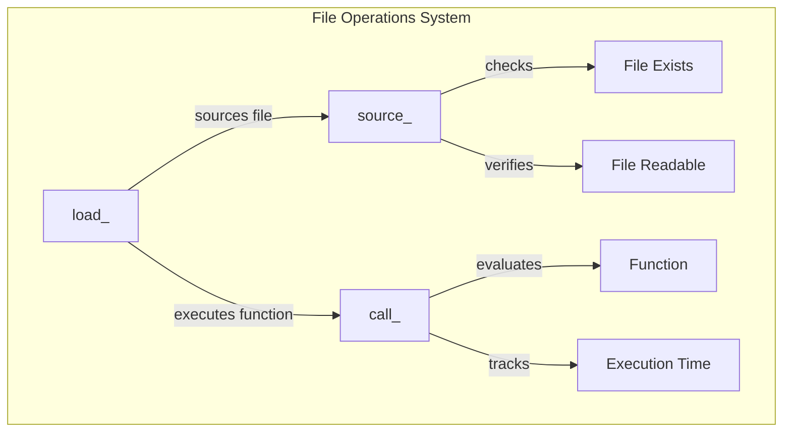

# Product Context

## System Purpose

The ahmyzsh shell configuration system serves as a sophisticated shell environment setup with:

1. Performance-Optimized Loading
   - Smart caching of path configurations
   - Timed execution monitoring
   - Conditional loading of components

2. Modular Configuration
   - Hierarchical file loading
   - Selective component initialization
   - Extensive function library

## Core Functions

### Configuration Management Functions

1. `load_all_config_and_settings_files()`
   - Purpose: Orchestrates entire configuration loading
   - Responsibility: Main entry point for config system
   - Usage: Called during system initialization

2. `load_config_or_settings_()`
   - Purpose: Directory-specific configuration loading
   - Responsibility: Manages individual config directories
   - Usage: Called by master loader for each config location

3. `Load_all_files_d()`
   - Purpose: Bulk shell script loading
   - Responsibility: Loads all .sh files in a directory
   - Usage: Basic file loading operations

4. `Load_all_files_d_v()`
   - Purpose: Verbose shell script loading
   - Responsibility: Loads files with detailed logging
   - Usage: When loading verification is needed

### Performance Monitoring Functions

1. `timer_()`
   - Purpose: Foundation timing function
   - Responsibility: Basic time calculations
   - Usage: Base for other timing functions

2. `timer_now()`
   - Purpose: Current execution timing
   - Responsibility: Track immediate timing
   - Usage: Real-time performance monitoring

3. `timer_from_then()`
   - Purpose: Custom interval timing
   - Responsibility: Track specific intervals
   - Usage: Custom performance measurements

4. `timer_all()`
   - Purpose: Global execution timing
   - Responsibility: Track total execution time
   - Usage: Overall performance monitoring

### File Operation Functions

1. `load_()`
   - Purpose: Smart file loading
   - Responsibility: Source files and execute functions
   - Usage: Primary file operation interface

2. `call_()`
   - Purpose: Function execution
   - Responsibility: Run and time functions
   - Usage: When function timing is needed

3. `source_()`
   - Purpose: Safe file sourcing
   - Responsibility: Validate and load files
   - Usage: Basic file inclusion operations

## Integration Flow

The functions work together to provide:

1. Reliable configuration loading
2. Performance monitoring
3. Safe file operations
4. Detailed logging when needed

This creates a robust and maintainable shell environment that can be easily extended and monitored.
