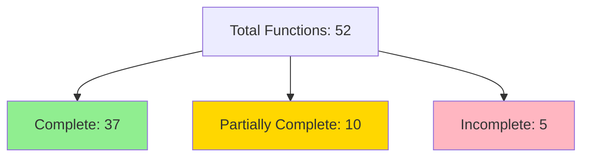

# Progress Report

## Completed Steps

1. Initial Project Analysis
   - ✅ Created knowledge graph of core components
   - ✅ Mapped system architecture and relationships
   - ✅ Documented initialization flow
   - ✅ Identified key subsystems

2. Core Systems Documentation
   - ✅ Path management system overview
   - ✅ Timer system architecture
   - ✅ Configuration loading patterns
   - ✅ Bootstrap process flow

3. Performance Analysis
   - ✅ Identified optimization mechanisms
   - ✅ Documented caching strategies
   - ✅ Mapped performance monitoring points
   - ✅ Analyzed timing system integration

4. Core Functions Documentation
   - ✅ Completed comprehensive README.md in core/functions
   - ✅ Documented all 52 shell script files
   - ✅ Categorized functions by purpose and implementation status
   - ✅ Identified improvement areas and dependencies

## Current Status

🟢 Completed: Core Functions Documentation
🟡 In Progress: Core Functions Implementation

### Core Functions Status Matrix

| Category            | Total  | Complete | Partially Complete | Incomplete |
| ------------------- | ------ | -------- | ------------------ | ---------- |
| System Init         | 5      | 4        | 0                  | 1          |
| Dev Tools           | 4      | 4        | 0                  | 0          |
| Custom Commands     | 9      | 6        | 2                  | 1          |
| Profile Management  | 2      | 1        | 0                  | 1          |
| Core System         | 9      | 7        | 2                  | 0          |
| Shell Config        | 7      | 6        | 1                  | 0          |
| Utility/Integration | 2      | 2        | 0                  | 0          |
| **TOTAL**           | **38** | **30**   | **5**              | **3**      |

### Implementation Phases

1. ✅ Initial Audit Phase
   - ✅ System Init (00000-00099)
   - ✅ Dev Tools (00100-00999)
   - ✅ Custom Commands (01000-04999)
   - ✅ Core System (86660-88888)
   - ✅ Shell Config (96660-96669)
   - ✅ Utility/Integration (99999+)

2. ✅ Documentation Phase
   - ✅ Function purpose documentation
   - ✅ Dependency mapping
   - ✅ Usage examples
   - ✅ Error handling docs

3. 🟡 Implementation Phase
   - [ ] Complete missing functions
   - [ ] Add error handling
   - [ ] Implement testing
   - [ ] Validate dependencies

### Completed Documentation

- Base system architecture
- Core function relationships
- Performance optimization patterns
- Initialization sequence

### Under Investigation

- Path caching mechanism details
- Timer system implementation specifics
- Environment state management
- Interactive feature initialization

## Next Steps

1. Path System Deep Dive
   - [ ] Analyze core/compute-path/path.sh
   - [ ] Document caching implementation
   - [ ] Map extended path computation
   - [ ] Study Conda integration

2. Timer System Analysis
   - [ ] Examine timer function implementations
   - [ ] Document performance impact
   - [ ] Study integration points
   - [ ] Analyze overhead patterns

3. Configuration System Review
   - [ ] Map file dependencies
   - [ ] Document load order
   - [ ] Study error handling
   - [ ] Analyze conditional loading

4. Interactive Shell Setup
   - [ ] Study Oh My Zsh integration
   - [ ] Document feature initialization
   - [ ] Analyze state management
   - [ ] Map user experience flow

## Known Issues/Questions

1. Path System
   - Cache invalidation strategy
   - Performance metrics collection
   - Path computation optimization
   - Cache storage format

2. Timer Implementation
   - Timing granularity control
   - Performance overhead measurement
   - Integration optimization
   - Metric standardization

3. Configuration Management
   - Load order dependencies
   - Error recovery procedures
   - Validation mechanisms
   - Performance implications

4. Interactive Features
   - Feature dependency chain
   - State transition triggers
   - Loading condition logic
   - Performance considerations

## Required Investigations

1. Code Analysis
   - [ ] Complete path.sh implementation review
   - [ ] Timer function deep dive
   - [ ] Configuration loading system
   - [ ] Interactive feature setup

2. Performance Review
   - [ ] Path caching effectiveness
   - [ ] Timer system overhead
   - [ ] Loading system optimization
   - [ ] Interactive mode impact

3. Documentation Updates
   - [ ] Extend system patterns
   - [ ] Update technical context
   - [ ] Enhance active context
   - [ ] Revise progress tracking

## Remaining Work

1. Implementation Details
   - ✅ Document all function implementations (core/functions README.md)
   - [ ] Map complete dependency chains
   - [ ] Analyze error handling patterns
   - [ ] Study optimization techniques

## Recently Completed

### Core Functions Documentation

- ✅ Created comprehensive README.md in core/functions
- ✅ Documented all major function categories:
  - System initialization components
  - Development tools and integrations
  - Custom commands and utilities
  - Core system functions
  - Shell configuration
  - Utility and integration functions
- ✅ Documented dependencies and requirements
- ✅ Added usage examples and configuration details

2. System Integration
   - [ ] Document cross-component interactions
   - [ ] Map data flow patterns
   - [ ] Analyze timing implications
   - [ ] Study state management

3. Documentation
   - [x] Added Layer 2 verification script and triad integration
   - [x] Added Layer 3A/3B instruction cards to `memory-bank/instructions/`
   - [x] Created two chat modes under `memory-bank/chatmodes/`
   - [x] Excluded `*.prompt.md` and `*.agent.md` via `.prettierignore`
   - [x] Added `scripts/verify-layer3b.sh` and validated chat modes (PASS)
   - [x] Created two prompt cards under `memory-bank/prompts/`
   - [x] Added `scripts/verify-layer3c.sh` and verified prompt files (PASS)
   - [x] Authored `layer-3c-prompt-files-factory.instructions.md`
   - [x] Added validators: `scripts/validate-memory-bank.sh`, `scripts/validate-chatmodes.sh`, `scripts/validate-prompts.sh`
   - [x] Added `scripts/triad-health.sh` and `scripts/list-slash-commands.sh`
   - [x] Created `.github/agents/` with `repo-steward.agent.md` and `research.agent.md`
   - [x] Deduplicated VS Code triad keys in `.vscode/settings.json` and added `chat.agentFilesLocations`
   - [x] Ran all validators and Triad Health twice — PASS
