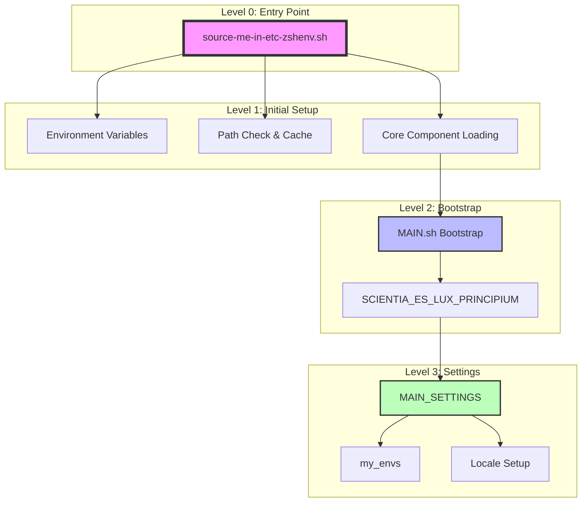

# System Patterns

## High-Level Initialization Sequence



## Branches to be Explored Later

### Level 1 Branches
1. Path Computation System
   ```mermaid
   graph LR
       A[Path Check] --> B[Cached Path]
       A --> C[New Path Computation]
       C --> D[Cache Generation]
   ```
   - TO BE EXPLORED: core/compute-path/path.sh
   - TO BE EXPLORED: Path caching mechanism

2. Core Component Loading
   ```mermaid
   graph LR
       A[Core Loading] --> B[MAIN-FUNCTIONS]
       A --> C[Compute Path]
       A --> D[Conda Init]
   ```
   - TO BE EXPLORED: Function definitions in MAIN-FUNCTIONS.sh
   - TO BE EXPLORED: Conda initialization process

### Level 2 Branches
1. Bootstrap Process
   ```mermaid
   graph LR
       A[MAIN.sh] --> B[Environment States]
       A --> C[Shell Validation]
       A --> D[Interactive Setup]
   ```
   - TO BE EXPLORED: Interactive shell features
   - TO BE EXPLORED: Environment state management

### Level 3 Branches
1. Settings System
   ```mermaid
   graph LR
       A[MAIN_SETTINGS] --> B[Node Environment]
       A --> C[Development Tools]
       A --> D[Locale Management]
   ```
   - TO BE EXPLORED: FNM integration
   - TO BE EXPLORED: Development tool setup

## Primary Functions By Level

### Level 0 (Entry Point)
- Environment exports
- Path validation
- Component sourcing

### Level 1 (Initial Setup)
- Path caching functions
- Extended path computation
- Core function loading

### Level 2 (Bootstrap)
- SCIENTIA_ES_LUX_PRINCIPIUM
- Shell validation
- Interactive detection

### Level 3 (Configuration)
- MAIN_SETTINGS
- Development environment setup
- Locale configuration

## Function Interaction Matrix

| Level | Calls | Depends On | Future Investigation |
|-------|-------|------------|---------------------|
| 0 | source_, load_ | None | Path computation details |
| 1 | call_, timer_ | Level 0 | Function implementations |
| 2 | isinteractive | Level 1 | Interactive features |
| 3 | my_envs, __LOCALE__ | Level 2 | Tool integration details |

## Notes for Future Investigation
1. Path System Details
2. Function Implementation Analysis
3. Tool Integration Mechanisms
4. Interactive Feature Setup
5. Environment State Management
