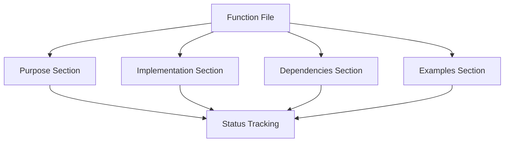
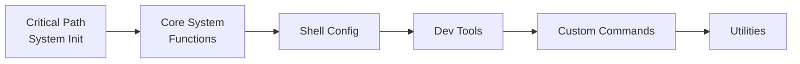
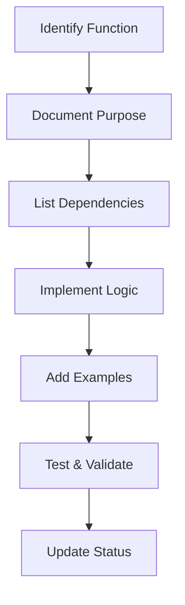
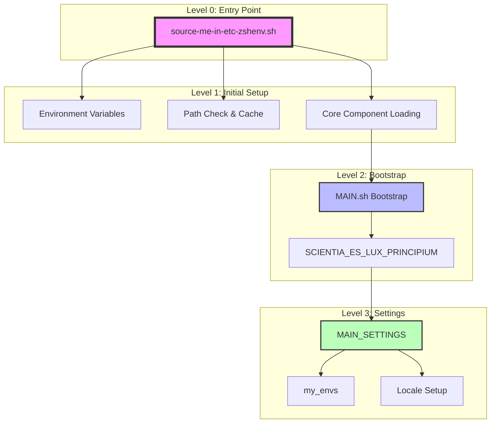
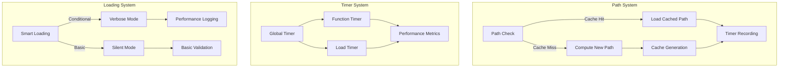
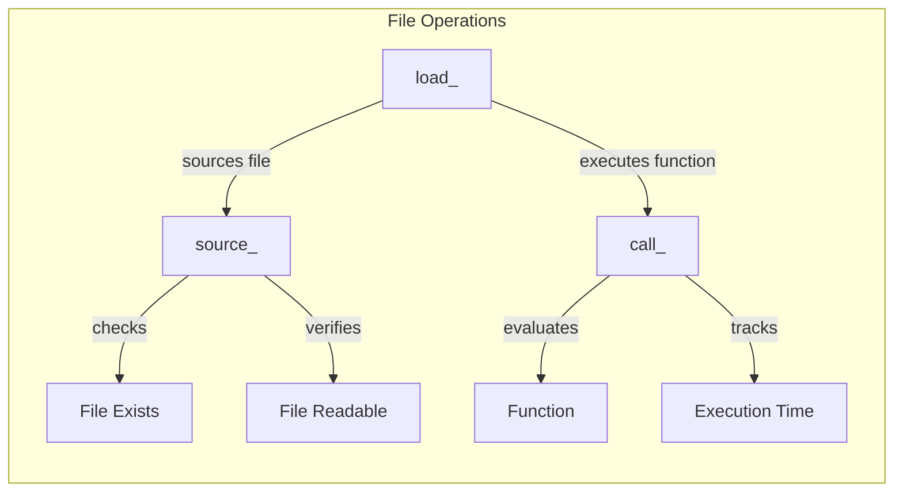
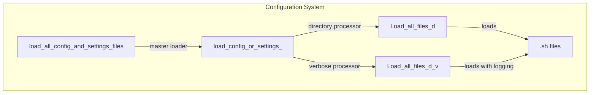
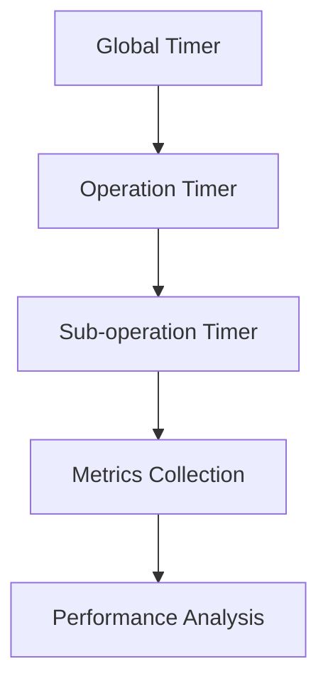
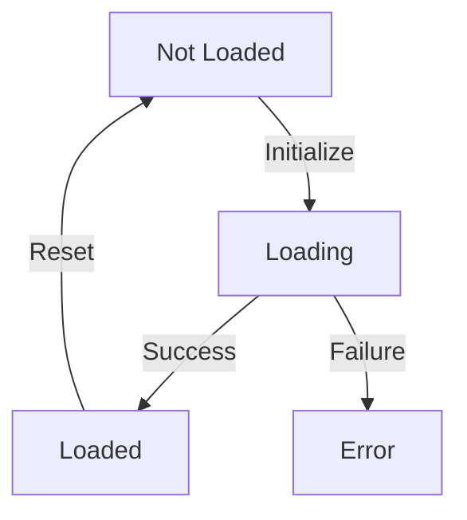
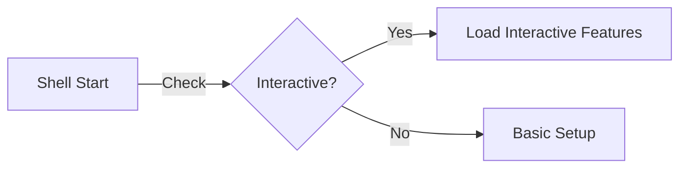

# System Patterns

## Core Functions Implementation Patterns

### Function Documentation Pattern

### Implementation Priority Pattern

### Function Completion Workflow

## High-Level Initialization Sequence

## Performance Optimization Patterns

## Core Function Patterns

### File Operation Patterns

### Configuration Loading Patterns

## Timing Patterns

### Basic Timing Pattern

### Performance Monitoring Pattern

## Function Interaction Matrix

| Level | Calls | Depends On | Performance Impact |
|-------|-------|------------|-------------------|
| 0 | source_, load_ | None | Path caching performance |
| 1 | call_, timer_ | Level 0 | Function timing overhead |
| 2 | isinteractive | Level 1 | Shell state checks |
| 3 | my_envs, __LOCALE__ | Level 2 | Environment loading |

## State Management Patterns

### Environment State Pattern

### Interactive Detection Pattern

## Error Handling Patterns

1. File Operation Errors
   - Existence checking
   - Permission validation
   - Fallback mechanisms
   - Error reporting

2. Function Execution Errors
   - Return value checking
   - Error code propagation
   - Verbose mode logging
   - Recovery procedures

## Notes for Investigation

1. Path System Details
   - Cache invalidation triggers
   - Path computation optimization
   - Cache storage format
   - Performance metrics

2. Timer System Implementation
   - Granularity control
   - Overhead measurement
   - Format standardization
   - Integration points

3. Configuration System
   - Load order dependencies
   - Error handling strategies
   - Performance impact
   - Validation methods

4. Interactive Features
   - Feature dependencies
   - Loading conditions
   - Performance impact
   - User experience
