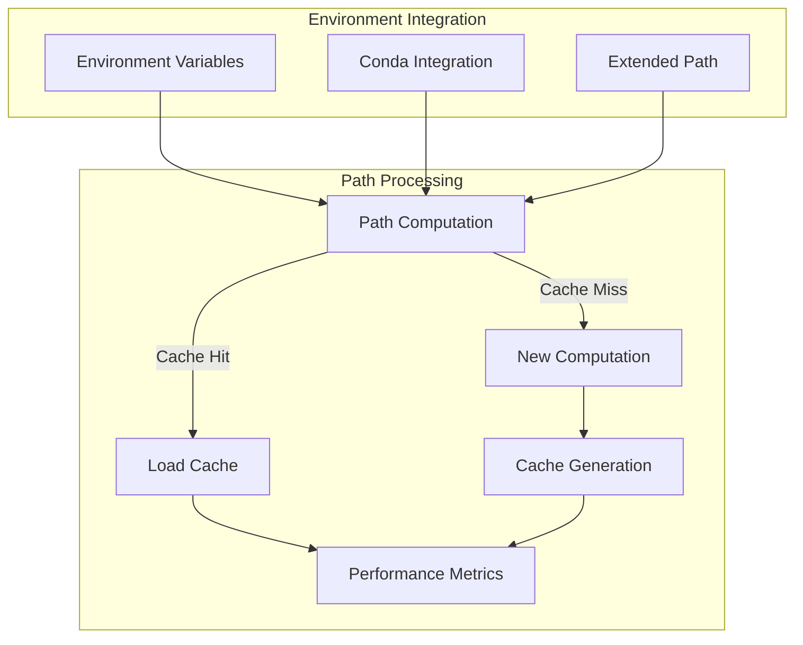
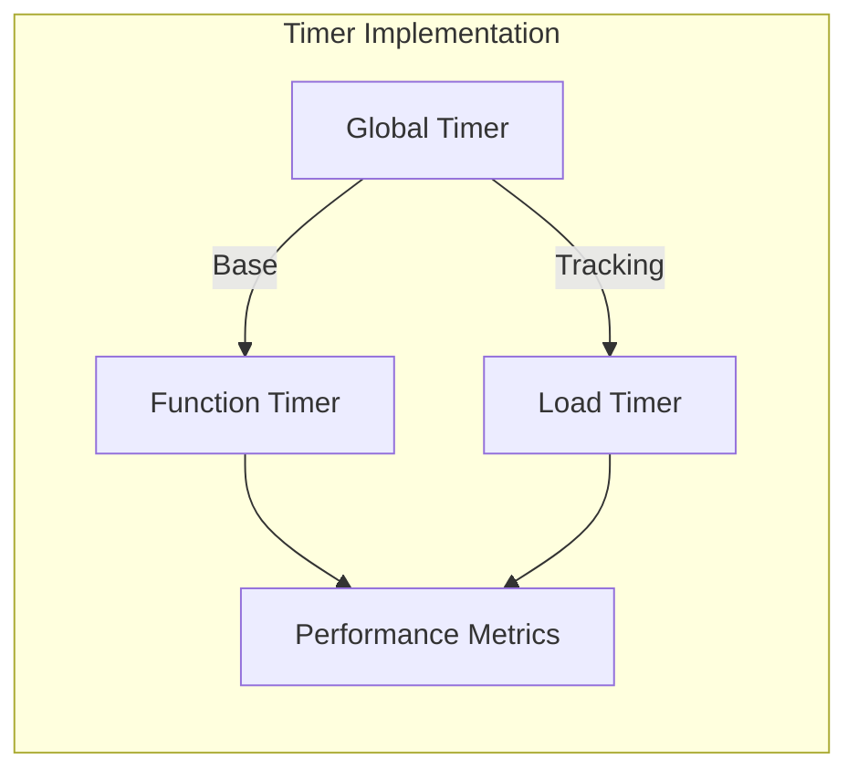
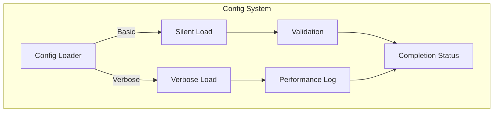

# Technical Context

## Core Systems

### Path Management System



### Timer System



### Configuration Management



## Environment Variables

### Core Variables

```bash
AHMYZSH="/projects/ahmyzsh"           # Base directory
AHMYZSH_CACHE="~/.cache/ahmyzsh" # Cache directory
CACHED_PATH="${AHMYZSH_CACHE}/path.env" # Path cache
TIMER_ALL_THEN="$(date +%s%N)"   # Timing reference
```

### Additional Settings

```bash
VERBOSA="1"                      # Verbosity level
MAIN_BOOTSTRAP="${AHMYZSH}/MAIN.sh" # Bootstrap path
IS_ZSH_="$(ps -o comm= -p $$)"   # Shell verification
```

## Performance Components

1. Path Caching System
   - Location: ${AHMYZSH_CACHE}/path.env
   - Invalidation: Manual or missing cache
   - Format: Shell environment format
   - Performance metrics tracked

2. Timing System
   - Global reference: TIMER_ALL_THEN
   - Function-level timing
   - Load time tracking
   - Performance monitoring

3. Loading Optimization
   - Conditional loading
   - Verbose/Silent modes
   - Performance logging
   - Cache utilization

## Core Functions

### File Operations

```bash
load_()      # Smart file loading with timing
source_()    # Safe file sourcing with validation
call_()      # Function execution with timing
```

### Timer Functions

```bash
timer_()           # Base timer function
timer_now()        # Current execution timing
timer_from_then()  # Custom interval timing
timer_all()        # Global execution timing
```

### Configuration Functions

```bash
load_all_config_and_settings_files()  # Master loader
load_config_or_settings_()            # Directory loader
Load_all_files_d()                    # Basic file loader
Load_all_files_d_v()                  # Verbose file loader
```

## System Requirements

### Shell Environment

- ZSH shell required
- Interactive/non-interactive detection
- Login shell support
- Environment state tracking

### File System

- Write access to cache directory
- Read access to configuration files
- Directory structure preservation
- Cache file management

### Development Tools

- Node.js with FNM (Fast Node Manager)
- Conda environment support
- Ruby/Perl environments
- Git integration

### Desktop Integration

- KDE/QT environment support
- Terminal compatibility
- Path computation requirements
- Shell integration features

## Technical Dependencies

1. Core Dependencies
   - ZSH shell environment
   - Core Unix utilities
   - File system access
   - Process management

2. Development Tools
   - Node.js and FNM
   - Conda for Python
   - Ruby environment
   - Perl modules

3. Shell Integration
   - Oh My Zsh framework
   - Custom plugins support
   - Theme compatibility
   - Command completion

4. Performance Tools
   - Timing utilities
   - Cache management
   - Performance monitoring
   - Metrics collection

## Configuration Structure

### Main Settings

1. Core Environment
   - Base paths
   - Cache locations
   - Environment variables
   - Shell preferences

2. Development Setup
   - Node.js configuration
   - Python environment
   - Ruby settings
   - Perl configuration

3. Performance Settings
   - Timer configuration
   - Cache management
   - Loading preferences
   - Verbosity control

### State Management

1. Environment States
   - LOAD_ENV_COMPLETED
   - ENVIRONNEMENT_LOADED
   - LOGIN_ENV_LOADED
   - INTERACTIVE_ENV_LOADED

2. State Tracking
   - State transitions
   - Once-only flags
   - State validation
   - Error handling
