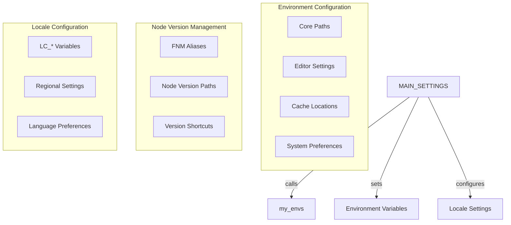

# Technical Context

## Environment Variables

Key environment variables used in the system:

- AHMYZSH: Base directory for the shell configuration
- AHMYZSH_CACHE: Cache directory for optimizations
- CACHED_PATH: Location of cached path environment
- TIMER_ALL_THEN: Timing reference for initialization

## Core Components

1. Path Computation System
   - Uses caching mechanism for optimization
   - Implements extended path computation
   - Conda integration
   - Performance timing metrics

2. Bootstrap System
   - MAIN.sh as primary bootstrap entry point
   - Modular sourcing of components
   - Error handling for missing files

## Settings Management

### Main Settings Structure

### Key Settings Components

1. Core Environment Variables
   - AHMYZSH and related paths
   - Editor and pager preferences
   - Cache directory locations
   - System-wide configurations

2. Node.js Environment
   - FNM (Fast Node Manager) configuration
   - Version aliases and paths
   - Default node version settings

3. Language and Locale
   - Comprehensive locale settings
   - Region-specific configurations
   - Character encoding settings

4. Development Tools
   - Ruby environment setup
   - Perl configuration
   - Python/Anaconda settings
   - GitHub credentials

## File Organization

- Core configuration files in root directory
- Specialized modules in core/ directory
- Compute-path specific functionality isolated
- Cache management system

## Technical Dependencies

- bash/zsh shell environment
- KDE/QT desktop environment support
- Conda environment system
- Core unix utilities (date, mkdir)
- Node.js version manager (fnm)
- Ruby/Perl/Python environments

## Configuration Functions

1. MAIN_SETTINGS()
   - Core environment setup
   - Default values initialization
   - System paths configuration
   - Editor preferences setup

2. my_envs()
   - Node.js environment setup
   - Development tool paths
   - GitHub configuration
   - Language-specific settings

3. __LOCALE__()
   - Default locale initialization
   - Language settings
   - Regional preferences
   - Character encoding

4. _LOCALE_()
   - Dynamic locale configuration
   - Language/region customization
   - Encoding management
