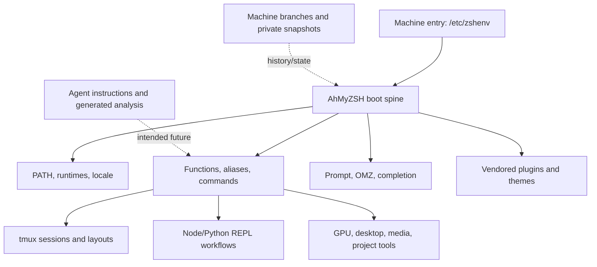
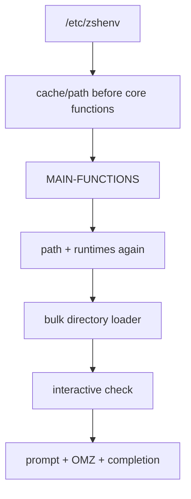
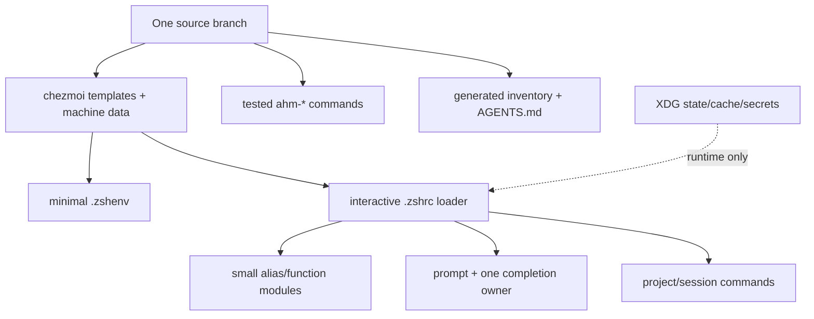

<!-- reports/2026-07-10-repository-audit.md -->

# AhMyZSH: repository archaeology, operational audit, and recovery map

**Audit date:** 2026-07-10
**Repository:** <https://github.com/LuxciumProject/ahmyzsh>
**Primary audited revision:** `main` at `ca0111a7` (2026-03-21)
**Scope:** all 29 remote branches, tags and reachable history; the current tree; linked repositories; startup behavior; aliases, functions, commands, tmux and REPL surfaces; the unmerged 2026 refactor; and current practices relevant to rebuilding the same ambitions safely.

## Executive conclusion

AhMyZSH is not merely a shell configuration. It evolved into five things at once:

1. a Zsh startup and environment framework;
2. a personal command and alias library;
3. a workstation and project-session orchestrator, especially around tmux;
4. a vendor/archive for third-party shell software and machine state;
5. a design notebook for a future personal operating environment, lately including agent and LLM workflows.

That breadth explains both its value and its drift. The repository contains real, reusable intent, but its present operational state is not a reliable installation. The current `main` boot exits successfully while hiding partial failures; major subsystems are duplicated or disconnected; machine-specific state is mixed with portable source; dependencies changed from submodules to copied trees without completing the transition; and generated analysis sometimes describes an intended system more confidently than the code supports.

The right recovery strategy is **preservation followed by characterization, then replacement behind stable interfaces**. It would be a mistake either to delete the old material as “messy dotfiles” or to make the entire existing loader work unchanged. The repository should be treated as an archaeological source and behavioral specification. Its valuable intentions can become a smaller, testable workstation platform.

### Current status at a glance

| Surface | What exists | Audit status | Judgment |
|---|---|---:|---|
| Zsh startup | system-wide `/etc/zshenv` entry, staged loaders, timers, prompt, OMZ, completion | **Partially operational** | Preserve intent; replace boot spine first |
| PATH/runtime setup | path registry, computed PATH, cache, Conda/FNM/rbenv/Cargo hooks | **Operational only on a matching old machine** | Redesign; do not repair by adding more guards |
| Aliases | about 1,989 alias declarations in 47 files | **Large mixed archive** | Inventory by use; promote complex/high-value entries to commands |
| Functions | 49 files, about 4,242 lines of `.sh` | **Mixed and collision-prone** | Salvage selected APIs; namespace and test |
| `core/bin` | 157 command files, 154 executable | **Valuable but uneven** | Triage individually; quarantine administrative commands |
| Tmux | four overlapping config/plugin/framework surfaces | **Base config usable; custom framework unreachable** | Rebuild one declarative session layer |
| Node REPL | separate repository with a sophisticated 2020 REPL | **Historically successful, currently detached and obsolete** | Rewrite from its behavioral intent |
| Python REPL | linked repository and alias references | **Mostly placeholder/missing startup file** | Build anew; little implementation to preserve |
| Prompt/completion | vendored Powerlevel10k, OMZ, external distro plugins | **Partial and order-sensitive** | Pin dependencies; simplify one completion owner |
| Options | 202 files, only two non-empty; one real option file | **Mostly documentary museum** | Archive prose; express policy once |
| AI/agent work | F42 agent bundle, prompts, inventories, Copilot wrappers | **Interesting prototype, divergent** | Salvage docs/agent contracts; remove auto-`eval` paths |
| Machine deployment | branch-per-machine/version history | **Historically useful, unsustainable** | Replace with one source branch plus machine data/templates |
| Vendored dependencies | OMZ, P10k, TPM, completions and themes | **Frozen or provenance-ambiguous** | Choose one dependency policy and regenerate |
| Private/generated state | history, environment snapshots, logs, whole Python venv | **Should not be source-controlled** | Quarantine, scan history, rotate exposed credentials, regenerate |

## 1. What was audited and how to read the confidence levels

This report combines four kinds of evidence:

- **Repository evidence:** full Git history, tree objects, branch ancestry, tags, file counts, executable metadata, source references and dependency declarations.
- **Behavioral evidence:** isolated startup tests using a temporary `HOME`, Zsh syntax checks and the unmerged refactor's own test suite.
- **Linked-project evidence:** current GitHub state of the referenced Luxcium repositories and upstream vendor repositories.
- **2026 practice research:** primary documentation for Zsh, Git, tmux, XDG, chezmoi, mise, direnv, uv, Atuin, Codex, Copilot CLI and shell analysis tools.

Status terms in this report mean:

- **Working:** directly exercised or structurally complete for its stated role.
- **Partial:** some behavior works, but missing dependencies, ordering, portability or tests prevent a reliable guarantee.
- **Unreachable:** implementation exists but the current boot or command surface does not invoke it.
- **Attempted:** enough source and history exist to establish intent, but not a complete usable path.
- **Archive:** valuable evidence or reference, not something that should load at runtime.
- **Obsolete:** tied to retired APIs, vanished dependencies or old machine assumptions.

An exit code of zero is not treated as proof of a healthy shell. This distinction matters throughout the repository.

## 2. The cumulative architecture that emerged

The repository's accumulated topology is best understood as concentric layers:



This architecture was trying to accomplish something coherent: enter any familiar machine and immediately recover paths, runtimes, projects, commands, prompt, session layouts and specialized interactive tools. The failure mode was not the ambition. It was that configuration, executable source, machine facts, vendored dependencies, generated state and historical memory all acquired equal authority during startup.

The desired future topology should keep the same human outcome while separating those kinds of material.

## 3. Branch archaeology: 29 branches are several generations, not 29 equivalent alternatives

There are exactly 29 remote branches. Some are historical machine snapshots, some are restructuring experiments, some are duplicate pointers, some contain large bodies of work never merged, and one is a current refactor on top of `main`.

### 3.1 Historical eras

#### Era A — 2020: personal metarepository and separate component repos

The earliest branches (`masterpcrace`, `pc-master-race`, `luxcium2`, `old-master`) show a metarepository built from many submodules: Oh My Zsh, Powerlevel10k, Powerline, custom Zsh, custom tmux, Nerd Fonts, Node REPL and Python REPL. Machine branches were effectively deployment state.

`backup-old-folders` is a special cold-storage branch with 21,594 tracked paths, 21,587 of which do not occur on current `main`. It should never be merged wholesale, but it must be retained until a content-level salvage pass is complete.

`fteat/simple-and-in-ordervX.X.X-20201210` and `next/fresh-start-v0.2.0-20202812` are explicit simplification/reorganization attempts. They are important because they expose which complexity was already recognized as a problem in 2020.

#### Era B — 2021–2022: `core/` expansion and distribution-specific workstations

The Fedora 32/34 and Kubuntu branches grow the current `core/` hierarchy, command collection, multimedia/desktop customization, tmux work, archives and runtime-manager integrations. These branches contain hundreds of commits not in `main`; they are not merely earlier pointers.

The three `from/*` branches are recovery/fork points from historical commit IDs. `p10k/try` isolates a prompt experiment. `temp/f34-ws` is a near-Fedora-34 working state. Kubuntu branches show an attempted distribution port rather than a clean platform abstraction.

#### Era C — 2023: Fedora 37 and Corsair One consolidation

The Fedora 37 family converges on the system-wide `/ahmyzsh` or `/projects/ahmyzsh` model. Several branches point at the same tip, showing names used as machine/version markers rather than distinct lines of development.

`fedora37-workstation` is unusual: almost all of its content is under `legacy/`. It appears to be an encapsulation attempt—moving the old system out of the way—rather than the lineage that became `main`.

#### Era D — 2024: F39 and the modern large tree

`ahmyzsh/corsair-one/f39/v0.2.0` is a direct ancestor of `main`. The modern tree now contains copied/vendored third-party repositories, `custom-tmux`, templates, documentation and the current boot structure. The tag `v0.2.0-unsafe` accurately signals that this was a milestone, not a production-quality release.

#### Era E — 2025: F41/F42 agent and analysis experiments

`corsair-one/f42/v0.0.0` diverges from `main`: it contains 21 unique commits and 40 unique paths while lacking 1,515 paths now on `main`. Its unique work includes an AhMyZSH bundle assembler, flattened alias bundle, agent instructions, memory-bank prompts, VS Code tasks and verification scripts. It also removes the committed `myenv` virtual environment, which is directionally correct.

This branch is a valuable salvage source for the future documentation and agent layer, but it is not the branch to continue directly.

#### Era F — 2026: documentation on `main`, implementation in an unmerged PR branch

Current `main` adds strong intent decomposition and critical-path analysis, but leaves the runtime architecture largely as it was. `copilot/make-analysis-compatible-with-zsh` is six commits directly on top of `main` and adds a modular loader, install/update scripts, tests and a Dockerfile. It is the only branch that should be evaluated as a near-current implementation proposal.

### 3.2 Complete branch inventory

“Unique” is the number of commits reachable from that branch but not from `main`. “Main ahead” is the inverse. File counts are the branch-tip trees.

| Branch | Tip date | Files | Relation to `main` | Interpretation and disposition |
|---|---:|---:|---|---|
| `masterpcrace` | 2020-04-03 | 39 | 82 unique / 61 main ahead | Earliest PC snapshot; retain as archaeology |
| `luxcium2` | 2020-04-20 | 59 | 108 / 61 | Early personal lineage; archive |
| `old-master` | 2020-04-20 | 59 | 133 / 61 | Best evidence of original submodule topology; preserve |
| `pc-master-race` | 2020-06-04 | 40 | 113 / 61 | Another machine lineage; archive after diff-based salvage |
| `backup-old-folders` | 2020-06-09 | 21,594 | 140 / 61 | Massive cold store; never merge; content-index and preserve |
| `fteat/simple-and-in-ordervX.X.X-20201210` | 2020-12-12 | 1,166 | 414 / 61 | First major simplification attempt; mine for design decisions |
| `luxcium` | 2021-01-01 | 59 | 139 / 61 | Early personal snapshot; archive |
| `master` | 2021-01-01 | 1,177 | 391 / 61 | Former primary line; compare to “simple” and “fresh start” |
| `next/fresh-start-v0.2.0-20202812` | 2021-01-01 | 1,266 | 430 / 61 | Deliberate new architecture experiment; preserve as design source |
| `fedora32-workstation` | 2021-06-15 | 2,351 | 459 / 61 | Major Fedora implementation generation; selective salvage |
| `from/2f31321` | 2022-01-31 | 2,367 | 527 / 61 | Recovery point; largely overlaps F34-era tree |
| `from/9de9ee6` | 2022-01-31 | 2,367 | 528 / 61 | Recovery point; inspect only for unique commits |
| `from/bb00c70` | 2022-01-31 | 2,367 | 529 / 61 | Recovery point; inspect only for unique commits |
| `p10k/try` | 2022-01-31 | 2,372 | 530 / 61 | Prompt experiment; extract config intent, not vendor tree |
| `temp/f34-ws` | 2022-02-08 | 2,373 | 532 / 61 | Temporary F34 state; selective salvage |
| `fedora34-workstation` | 2022-08-22 | 2,367 | 534 / 61 | Mature F34 workstation line; high-value behavioral reference |
| `kubuntu-workstation-v0.2` | 2022-08-22 | 2,373 | 543 / 61 | Distribution-port attempt; use to identify platform variation |
| `kbuntu-workstation` | 2022-12-20 | 2,418 | 568 / 61 | Kubuntu operational line; preserve platform-specific intent |
| `kbuntu-workstation-fix` | 2022-12-20 | 2,426 | 571 / 61 | Fix tip of Kubuntu line; prefer this over its predecessor for salvage |
| `fedora37-O.O.O-AhMyZSH` | 2023-04-13 | 2,474 | ancestor; main +49 | Same F37-generation tip; historical label |
| `fedora37/0.1.1/ahmyzsh-main` | 2023-04-13 | 2,474 | ancestor; main +49 | Same tip; historical label |
| `CorsairOne/f37/ahmyzsh/0.1.1` | 2023-04-16 | 2,475 | ancestor; main +47 | Direct modern ancestor; machine/version milestone |
| `fedora37-workstation` | 2023-07-25 | 2,269 | 571 / 61 | `legacy/` encapsulation experiment; preserve separately |
| `workstation-F37` | 2023-07-25 | 2,474 | 1 / 49 | One-commit side branch near F37; inspect and tag |
| `ahmyzsh/corsairOne/f37/v0.1.2/main` | 2024-05-17 | 4,107 | ancestor; main +29 | Direct ancestor; release/machine milestone |
| `ahmyzsh/corsair-one/f39/v0.2.0` | 2024-05-18 | 4,113 | ancestor; main +23 | Direct ancestor and modern baseline |
| `corsair-one/f42/v0.0.0` | 2025-11-04 | 2,678 | 21 / main 6 | Divergent agent/analysis/tooling experiment; cherry-pick concepts only |
| `main` | 2026-03-21 | 4,153 | reference | Current documentary head; not yet a reliable runtime |
| `copilot/make-analysis-compatible-with-zsh` | 2026-03-21 | 4,167 | 6 unique / main 0 | Current refactor proposal; useful foundation, not merge-ready as-is |

### 3.3 Tags

The tags describe snapshots rather than a conventional release train:

| Tag | Date | Meaning inferred from history |
|---|---:|---|
| `ZE430x-fedora-workstation-20201121` | 2020-11-21 | machine/workstation snapshot |
| `FEDORA32-E395D93-201212` | 2020-12-12 | Fedora 32 machine snapshot |
| `2021-03-12_07-53-00` | 2021-03-12 | timestamp snapshot |
| `TMUX-20210426` | 2021-04-26 | tmux-focused milestone |
| `v0.2.0-unsafe` | 2024-05-17 | explicitly unsafe version marker |
| `f41v0.1.1` | 2025-09-05 | Fedora 41 milestone |

Before any branch deletion, create immutable preservation tags or a Git bundle, then record a branch manifest with tip IDs. Branch names currently carry machine context that Git alone will not explain later.

## 4. Current tree: size, composition and why it feels larger than its source

Current `main` contains 4,153 tracked paths. The supplied archive is about 21 MiB compressed and 58 MiB extracted.

The largest surfaces are not all authored runtime code:

| Area | Approximate content | Interpretation |
|---|---:|---|
| `myenv/lib` | 1,487 files: 721 `.py`, 718 `.pyc` | committed Python 3.11 virtual environment; generated artifact |
| `ohmyzsh/plugins` | 769 files | vendored upstream dependency |
| `themes/material-dir-icons` | 397 files | vendored/generated theme asset |
| `core/options` | 202 files; only 2 non-empty | mostly documentary expansion of option names |
| `core/bin` | 157 files; 154 executable | genuine command collection |
| `plugins/zsh-completions*` | about 288 files across live and backup copies | vendored dependency plus duplicate backup |
| `ohmyzsh/themes` | 142 files | vendored upstream dependency |
| `custom-tmux` | 121 files | authored framework plus copied tmux-powerline |
| `powerlevel10k/gitstatus` | 62 files | vendored prompt dependency |
| `core/functions` | 49 files; about 4,242 `.sh` lines | authored function library |
| `core/aliases` | 47 files; about 7,718 `.sh` lines | authored/generated alias library |
| `private/env` | 39 files | machine/user state mixed with source |

The apparent “system” therefore includes at least four different ownership classes:

1. authored source;
2. copied upstream source;
3. generated or installed state;
4. historical/private evidence.

The rebuild should make these classes visible in the directory structure and ensure only the first class loads by default.

## 5. The real startup order and its failure modes

### 5.1 Current critical path

The intended entry is system-wide: `/etc/zshenv` sources `source-me-in-etc-zshenv.sh`. The current order is:

1. print an ANSI red escape sequence;
2. start a timer;
3. assign `AHMYZSH=/projects/ahmyzsh` and cache paths;
4. set locale and KDE-related environment;
5. on a cache miss, source `core/compute-path/path.sh` and call `cache_path`;
6. source `core/MAIN-FUNCTIONS.sh`;
7. source `path.sh` again and source Conda integration;
8. call `__compute_extended_path`;
9. source `core/MAIN.sh` and invoke `SCIENTIA_ES_LUX_PRINCIPIUM`;
10. detect Zsh through `ps | grep`, set a reload guard and load settings/env/locale;
11. load directories in this exact order: `paths`, `layouts`, `compute-path`, `functions`, `aliases`, `env`;
12. source `~/.env`, initialize FNM, then reset terminal color;
13. only now test whether the shell is interactive;
14. for an interactive shell, load prompt, Oh My Zsh, options twice, autosuggestions, autocomplete, completion security/permissions, compilation and key bindings.

Within each loaded directory, glob expansion makes file names the implicit ordering system. The `zNNNNN-` prefixes are therefore not cosmetic—they form an undocumented dependency graph.



### 5.2 Reproduced behavior

In an isolated temporary `HOME`, current `main` completed with exit code zero, but emitted these classes of errors:

- missing `fnm`;
- `call_` missing while the cold-cache path was already executing;
- unavailable `fr_CA` locale warnings;
- missing `rbenv` and Cargo environment;
- two prompt-related “fatal library” messages.

The non-interactive test took approximately 229 ms and the interactive test approximately 279 ms in the audit container. Those times are not representative of the original workstation because many integrations were absent or failed early. More importantly, the non-interactive shell wrote ANSI control bytes to standard output. A script, SSH command or cron consumer can therefore receive polluted output while AhMyZSH still reports success.

### 5.3 Root causes

#### System-wide entry is doing interactive work

Zsh's official startup model makes `/etc/zshenv` and `.zshenv` the unavoidable environment layer, including for non-interactive shells. It recommends overriding global startup behavior in later per-user files rather than turning the unavoidable layer into a full interactive framework. The current design performs PATH computation, runtime probing, output and configuration loading before the interactive guard. See the [official Zsh startup-files documentation](https://zsh.sourceforge.io/Doc/Release/Files.html).

#### Cold boot has a concrete ordering bug

On a cold cache, `cache_path -> set_path -> __compute_extended_path -> call_` runs before `MAIN-FUNCTIONS.sh` defines `call_`. This is not theoretical; the isolated boot reproduced it. A warm machine can hide this defect because the cache changes the path through the loader.

#### The same responsibilities load more than once

`path.sh` is sourced directly, then the `compute-path` directory is bulk-loaded. Options and key bindings also load through multiple paths. Duplicate function names are overwritten according to filename order; later files silently become authoritative. For example, path helper definitions occur in several files, and the last source wins.

#### Errors are deliberately soft but status is not recorded

The system often swallows missing command/file errors to keep the shell opening. That is a defensible usability goal, but without a phase-status record it turns “degraded” into “apparently healthy.” A future loader should preserve best-effort startup while exposing a concise `ahm doctor` report and a strict CI mode.

#### Boot performs mutation

Every interactive start can compile files and run completion permission changes (`compaudit | xargs chmod ...`). Startup should not silently change permissions or rebuild caches without validating targets and reporting what happened.

## 6. Subsystem audit

### 6.1 PATH, machine facts and runtime managers

The path subsystem contains genuine sophistication: a registry of project locations, helpers to append/prepend/deduplicate variables, hash generations, a persistent cache and timing instrumentation. It records years of desired workstation topology.

It is also the critical technical knot:

- PATH is rebuilt from a machine-specific base rather than composed from verified capabilities;
- CUDA 12.4, Fedora `/usr/lib64` paths, `/projects/...`, a user-specific FNM directory and project paths are hard-coded;
- Go paths are duplicated;
- Conda, FNM, rbenv and Cargo are initialized unconditionally or near-unconditionally;
- the cache writes `export PATH=$PATH` without robust shell quoting;
- deduplication uses `eval` and external Perl;
- an older annex path contains ten generations of PATH hashes, terminal effects and an expression that attempts to execute cached file content;
- cache correctness depends on files and programs that are not represented in the cache key.

**Judgment:** preserve the list of desired path entries and machine roles as data; replace the mechanism. Zsh can deduplicate arrays natively with `typeset -U path PATH`. A single runtime manager can own most language shims, while project-specific environments remain local.

A 2026 baseline should use:

- XDG locations for configuration, data, state and cache according to the [XDG Base Directory specification](https://www.freedesktop.org/wiki/Specifications/basedir-spec/);
- [mise activation for interactive shells and shims/`mise exec` for scripts and editors](https://mise.jdx.dev/getting-started.html), avoiding one-off initialization blocks for every runtime;
- [direnv](https://direnv.net/) only for explicit, authorized per-project environment changes;
- [uv projects and lockfiles](https://docs.astral.sh/uv/guides/projects/) for Python, regenerating `.venv` rather than committing it.

This is not a demand to adopt every named tool. The architectural requirement is **one owner per responsibility**. If FNM remains the Node owner, do not also activate Node through mise. If Conda is required for CUDA/scientific environments, isolate it to those projects instead of every shell.

### 6.2 Settings, locale and machine detection

The repository encodes Fedora, Kubuntu, KDE, Corsair One, NVIDIA and per-user assumptions directly in startup files. It uses process inspection to rediscover that Zsh is running and hardcodes `fr_CA` locale values that may not be installed.

These are machine facts, not loader logic. They belong in a typed machine profile such as:

- OS family and package manager;
- host role and graphical environment;
- available GPU stack;
- locale preference plus availability;
- project root;
- enabled optional modules.

The profile should be generated or templated during deployment and read without forking. It should never be inferred through `ps | grep` when Zsh already exposes its identity.

### 6.3 Prompt, Oh My Zsh and completion

Powerlevel10k is activated before Oh My Zsh; an instant-prompt function exists but points at an inconsistent location and is commented out. Oh My Zsh is then sourced with a substantial plugin list. Additional autosuggestion and syntax-highlighting code is expected under distribution paths such as `/usr/share`, while completion initialization is split among OMZ, bash compatibility and custom directories.

The result is order-sensitive:

- prompt state can be reinterpreted after OMZ loads;
- completion has no single owner;
- external plugins silently depend on how Fedora/Kubuntu packaged them;
- `ZSH_CUSTOM` points at the whole AhMyZSH repository, which is broader than an OMZ custom directory;
- startup compilation and completion permission changes happen eagerly.

The committed Powerlevel10k tree matches an upstream 2022 commit, while upstream has moved substantially since. The committed OMZ and TPM trees do not match current upstream tips exactly, suggesting old versions and/or local changes without a recorded patch series.

**Judgment:** the custom prompt configuration is valuable. Preserve it as a user-visible behavior. Then either pin and update Powerlevel10k cleanly or evaluate a migration to [Starship's declarative prompt configuration](https://starship.rs/config/). Do not change the prompt and the loader simultaneously; prompt fidelity is part of the user's daily interface.

### 6.4 Zsh options

`core/options` contains 202 files, but only two are non-empty. One active file holds seven `setopt` statements. The large `z96660x-load_options.sh` and `z96661x-load_options_list.sh` files mostly duplicate Zsh manual prose.

This surface appears to be an attempted self-documenting option system that never became executable policy. It should be split into:

- one short, reviewed option module grouped by behavior;
- a generated reference document outside the runtime path;
- tests for the few options whose interaction matters, especially history and globbing.

### 6.5 Aliases

There are about 1,989 alias declarations across 47 files. The largest categories include roughly 561 sound aliases, 461 console-font aliases, 285 Redis aliases, 169 Git aliases and 127 general aliases. This reveals a useful pattern: aliases were used not just as abbreviations, but as a discoverable personal command vocabulary and an experimental database.

The drawbacks are substantial:

- repeated names make behavior depend on source order;
- common commands are shadowed (`vim`, `python`, and high-impact system names among them);
- long aliases embed control flow, project paths or asynchronous administrative actions;
- generated inventories are tied to `/projects/templates/ahmyzsh`, not the current root;
- some categories belong to old projects or retired CLIs;
- static inventories include generated conclusions that were not verified against runtime behavior.

**Disposition model:**

| Alias type | Action |
|---|---|
| short, memorable, side-effect-free abbreviation | keep in a small topic module |
| navigation to a current project | generate from project registry or replace with zoxide/project picker |
| arguments, branching, pipes or mutation | promote to a named command with `--help` |
| administration, reboot, firewall, package mutation | quarantine; require explicit command and confirmation/dry-run |
| old project/API | archive with provenance, disabled by default |
| duplicate/conflicting | choose one canonical definition; add collision test |

Use runtime telemetry locally—without uploading command history—to answer what remains valuable. A temporary “alias invoked” wrapper or Atuin history query can produce frequency and recency, after which telemetry can be removed. [Atuin stores enhanced history in SQLite and offers optional encrypted synchronization](https://docs.atuin.sh/cli/guide/getting-started/); it can also [import existing history](https://docs.atuin.sh/cli/guide/import/). [zoxide](https://github.com/ajeetdsouza/zoxide) and [fzf](https://github.com/junegunn/fzf) can replace hundreds of brittle directory aliases with learned navigation and explicit selection.

### 6.6 Functions

The 49 function files are a more promising salvage surface than the raw alias count suggests. They include path operations, sourcing helpers, timers, array/list utilities, project helpers, tmux integration and assorted shell conveniences.

The current loader, however, creates a global namespace and lets later files overwrite earlier functions. Some helpers use `eval` for indirect invocation; some depend on globals set elsewhere; some are named by historical source order rather than API purpose.

The future library should distinguish:

- private implementation functions such as `_ahm_path_add`;
- public interactive functions such as `cproj`;
- standalone commands in `bin/`;
- compatibility shims carrying deprecation warnings.

Every public function should have a one-line purpose, inputs, return status and dependencies. Function definition order should not be used as dependency injection.

### 6.7 `core/bin`: the genuine command toolbox

`core/bin` has 157 files and 154 executable entries. Its themes include:

- timestamps, IDs, hex and conversion tools;
- file/directory iteration and URL helpers;
- memory, priority and system inspection;
- NVIDIA settings, fan/rendering and CUDA setup;
- Node/FNM/npm/yarn helpers;
- Docker and systemd helpers;
- DNF installation/update tools;
- VS Code download, update, portable and backup tools;
- audio routing and sound helpers;
- Conda helpers;
- KDE panel and Plymouth customization;
- project-specific media and image movers.

This is one of the repository's most valuable surfaces, but executable metadata currently overstates readiness. Ten command entries have empty/corrupted content, no usable shebang, or a malformed interpreter path: `cudarepoadd`, `dedup_pathvar`, `dnfupdateall`, `echostdout`, `getstampdy`, `gettimestampu`, `uxidec`, `getvscodeportable-js.mjs`, `mkloopback`, and `updateall.deprecated`. In particular, `uxidec` contains unrelated tree-listing material.

The command README also describes some entries as complete when their bodies do not support that claim.

The NVIDIA, firewall, loopback, package-management, system-service, shutdown/reboot and updater commands must be quarantined until each has:

- a valid interpreter and strict syntax check;
- platform/capability guards;
- `--help` and a no-side-effect `--check` or `--dry-run` mode;
- explicit privilege escalation at the smallest operation;
- idempotency and an undo/recovery note;
- no hidden dependency on the interactive alias/function namespace.

Commands should become the stable interface of the future platform, ideally with an `ahm-` prefix to avoid collisions.

### 6.8 Tmux: strong intent, four competing surfaces

Tmux appears in four forms:

1. `tmux/tmux.conf`: a small, readable 39-line configuration with mouse support, `C-a`, split/navigation bindings and reload behavior;
2. `custom-tmux/`: 121 files and about 11,970 shell lines implementing session layouts, project functions, a command vocabulary and a copied tmux-powerline;
3. `plugins/tmux/tpm`: a copied Tmux Plugin Manager tree;
4. `themes/tmux`: older theme/config material.

The simple `tmux.conf` is plausibly usable by itself. The custom framework is not reached by current main startup. The path registry assigns `CUSTOM_TMUX=${AHMYZSH}/tmux`, while the framework is actually under `${AHMYZSH}/custom-tmux`; its sourcing is commented out. Internal names also disagree: code expects `common.tmux.config` and `theme.tmux.config` where the tree uses `.conf`, and expects `powerline` where the directory is `tmux-powerline`.

Project-session functions reveal the successful historical behavior:

- attach-or-create named sessions;
- deterministic windows and panes;
- project directory and editor integration;
- dedicated Python and JavaScript REPL panes;
- status/powerline theme and rapid reload;
- layouts for specific projects such as PATH_LXIO, Questrade and Heroku work.

That behavior is worth rebuilding. The current 12k-line framework is not worth making globally sourceable unchanged.

**Target:** one `tmux.conf`, one pinned plugin mechanism if plugins remain, and one data-driven session command. Each session specification should declare name, working directory, windows, pane commands and optional capabilities. A validator can reject missing directories/programs before tmux is mutated. Tmux itself loads its config once at server start and supports explicit reload through `source-file`, as documented in the [tmux manual](https://man7.org/linux/man-pages/man1/tmux.1.html); the new design should use that lifecycle rather than coupling tmux setup to every Zsh boot.

### 6.9 Node REPL

The separate public `Luxcium/node-repl` repository still exists. Its historical implementation was more than an alias: it used Node's REPL API, a colored prompt, persistent history and customized inspection; preloaded functional-programming tools and DOM/browser automation; exposed short context variables; loaded Questrade-related helpers; and included a TCP socket REPL path.

This was a genuinely implemented and likely useful personal lab. It is now detached from AhMyZSH:

- the directory named in `.gitmodules` is absent from current `main`;
- the active `js` alias uses `rlwrap node`, while the custom REPL alias is commented out;
- dependencies are from the Node 12 / TypeScript 3.7 / Puppeteer 2 era;
- domain-specific financial/API context is mixed into the general REPL;
- a network REPL has an unacceptable default security posture unless strictly local and authenticated.

**Rebuild from intent:** a small modern Node package using `node:repl`, a tracked ESM preload module, safe persistent history and explicit optional context packs. Browser, DOM and project adapters should load only when requested. No listening socket should be enabled by default.

### 6.10 Python REPL

The public `Luxcium/python-repl` repository also exists, but its main branch has only five files and the Fedora branch adds no substantial startup implementation. It is a placeholder/scaffold rather than the Python equivalent of the Node REPL.

Current AhMyZSH defines a `py` alias using `PYTHONSTARTUP=$HOME/.pythonrc`, but `.pythonrc` is not tracked. The apparent integrated Python REPL therefore depends on external machine state.

**Judgment:** this is an attempted surface, not a recoverable implementation. Start with a tracked `PYTHONSTARTUP` module or an IPython profile, safe history, pretty inspection and optional project packs. Manage its dependencies through a `pyproject.toml` and `uv.lock`; never commit the resulting environment.

### 6.11 Agent and LLM surfaces

The F42 branch contains the most explicit attempt to make the repository legible to agents: `.github/copilot-instructions.md`, memory-bank prompts/instructions, an analysis bundle assembler, validators, snapshots and a flattened alias artifact. Current `main` contains substantial 2026 analytical documents.

This direction is valuable, with two cautions:

1. generated reports must be labeled as hypotheses until their counts and claims are reproduced from source;
2. an AI suggestion must never be automatically executed.

The existing `ghcs`-style wrapper that passes suggested command text to `eval` crosses that boundary and should be removed or replaced by a print/review/copy flow. Older OpenAI wrappers call retired edit models/endpoints and hardcode another monorepo path, so they are obsolete implementations even though the intent—terminal-assisted rewriting and explanation—remains relevant.

GitHub retired the `gh-copilot` extension on 2025-10-25 in favor of the standalone Copilot CLI ([official deprecation notice](https://github.blog/changelog/2025-09-25-upcoming-deprecation-of-gh-copilot-cli-extension/), [current CLI overview](https://docs.github.com/copilot/concepts/agents/about-copilot-cli)). Those aliases should not be repaired against the retired extension.

For Codex, a small root `AGENTS.md` should describe repository layout, safe commands, conventions and definition of done, with deeper files only where scope changes. This is the pattern in the [official `AGENTS.md` guide](https://developers.openai.com/codex/guides/agents-md) and [Codex best practices](https://developers.openai.com/codex/learn/best-practices). Reproducible, reviewable tasks can use [`codex exec`](https://developers.openai.com/codex/cli) without granting suggested shell text implicit authority.

### 6.12 Documentation and memory bank

Current documents correctly identify many critical-path issues: repeated PATH sourcing, subprocess-heavy timers, non-interactive work, `eval`, option/keybinding duplication, empty PATH elements, disabled instant prompt and unquoted cache output.

They are a design blueprint, not proof of implementation. Some inventory numbers are inflated: the current tree has 49 function files rather than “about 100,” and 157 `core/bin` entries rather than “170+.” Memory-bank percentage estimates such as completion scores are not traceable to executable acceptance criteria.

Keep the intent decomposition. Replace status prose with generated inventories and test-linked claims.

### 6.13 Private, generated and machine-state material

The current public tree includes files named as shell histories, private profiles, environment snapshots, network/firewall material, logs and a full Python virtual environment. This report intentionally does not reproduce their contents.

Even if current values appear empty or harmless, a public Git repository retains historical blobs. The safe procedure is:

1. scan all reachable history with a proper secret scanner;
2. rotate any credential that was ever committed;
3. move secrets to a password manager or ignored local/XDG state;
4. only then consider history rewriting as a separate coordinated operation.

Deleting the current file is not credential remediation. `myenv`, `.pyc` files, logs, caches, completion dumps, generated inventories and vendor build products should be reproducible artifacts outside source control.

## 7. Dependency and submodule topology

Current `.gitmodules` declares four components:

- `powerlevel10k`;
- `ohmyzsh`;
- `node-repl`;
- `python-repl`.

The actual current tree disagrees:

- Powerlevel10k and Oh My Zsh are ordinary tracked directories, not gitlinks;
- Node REPL and Python REPL directories are absent;
- older branches had real gitlinks for custom-tmux, custom-zsh, Nerd Fonts, Node/Python REPLs, Oh My Zsh, Powerlevel10k, Powerline and others;
- later Fedora branches retained some gitlinks, while the F37/F39 lineage converted major dependencies into copied trees.

At audit time:

- `Luxcium/node-repl` and `Luxcium/python-repl` are public and unarchived, although old;
- the previously referenced Luxcium forks for custom-tmux, custom-zsh, Powerline, Powerlevel10k, Oh My Zsh and Nerd Fonts were not publicly resolvable at their recorded URLs;
- vendored Powerlevel10k is pinned only implicitly by its copied content;
- vendored Oh My Zsh and TPM have ambiguous provenance because their trees do not exactly match current upstream heads and local patches are not isolated.

Git submodules are appropriate when separate history and exact component versions are intentional; the [Git submodule documentation](https://git-scm.com/docs/gitsubmodules) explicitly models one repository embedding another at a fixed commit. They are not useful when `.gitmodules` lies about the tree.

Choose one policy per dependency:

| Policy | Use when | Required record |
|---|---|---|
| package/tool installer | no local patch is required | package name, version constraint/lock and install test |
| true Git submodule | component remains a separately developed repo | URL, gitlink commit, update procedure |
| subtree/vendor | source must be available offline or patched | upstream URL, exact commit, license, patch series/update command |
| authored local module | code belongs to AhMyZSH | normal source and tests; no fake upstream metadata |

Remove stale `.gitmodules` entries only after linked content and history have been preserved in the salvage manifest.

## 8. Evaluation of the unmerged 2026 refactor

The branch `copilot/make-analysis-compatible-with-zsh` adds 24 changed paths relative to `main` with approximately 2,124 insertions and 923 deletions. It introduces:

- `lib/detect.sh`, `timer.sh`, `path.sh`, `locale.sh`, `loader.sh`, `runtimes.sh`;
- installation, update and test scripts;
- a Dockerfile and package metadata;
- guards and more explicit phases.

Its current test suite passed locally: **56 passed, 0 failed, 0 skipped**. It checks critical syntax, boot guards, operator precedence, absence of hard-coded boot paths in key areas, and several loader invariants. Its measured interactive startup in the audit environment was about **2,078 ms**.

This is the strongest existing implementation attempt, but passing its tests does not establish functional equivalence. The suite does not yet prove:

- a correct prompt and completion graph;
- alias/function collision behavior;
- tmux integration;
- either custom REPL;
- runtime-manager behavior with real toolchains;
- migration from the system-wide old installation;
- clean standard output for non-interactive shells;
- behavior on supported Fedora/Kubuntu generations.

The refactor also retains `eval` in generic PATH processing and runtime initialization, uses subprocess-heavy deduplication, and writes a cache format that deserves stronger escaping and atomic replacement. A two-second interactive boot is a regression target, even if the test environment is imperfect.

**Recommendation:** do not merge the branch untouched. Reuse its phase separation, test harness and install/update scaffolding as a staging branch. First add characterization tests around current desired behavior, then simplify `lib/path.sh` and make non-interactive output/status guarantees explicit.

## 9. Prioritized risk register

### Priority 0 — preserve before changing

- Bundle or mirror all 29 branch tips and tags.
- Record commit IDs and linked repository state.
- Secret-scan all reachable history and rotate anything exposed.
- Preserve machine/project intent without copying history/private values into new runtime config.

### Priority 1 — prevent incorrect shell behavior

- Remove full framework loading and all output from `/etc/zshenv`/`.zshenv`.
- Fix the cold-cache undefined-`call_` path by eliminating that old boot path, not by moving one definition earlier.
- Stop unconditional runtime initialization.
- Stop permission mutation and compilation during ordinary startup.
- Add phase status and a `doctor` command.

### Priority 2 — stop ambiguous execution

- Remove automatic `eval` of AI-generated command text.
- Quarantine administrative and system-mutating aliases/commands.
- Fix or disable the ten malformed/empty `core/bin` executables.
- Detect duplicate aliases/functions and command-name collisions in CI.

### Priority 3 — restore dependency integrity

- Choose a vendor/submodule/package policy.
- Pin prompt, OMZ, completion and tmux dependencies with provenance.
- Remove the committed venv and duplicate vendor backups.
- Replace retired Copilot/OpenAI integrations.

### Priority 4 — recover high-value workflows

- Rebuild declarative tmux project sessions.
- Rebuild the Node REPL from its behaviors.
- implement the Python REPL as a new tracked profile.
- restore project navigation from a registry rather than hard-coded alias files.

## 10. Proposed 2026 architecture

The target is deliberately smaller than the archive while supporting more machines and agents.



### 10.1 Source/deployment split

Use one main branch for portable source. Express machine differences as data and templates. [chezmoi supports machine-specific templates and conditional configuration](https://chezmoi.io/user-guide/manage-machine-to-machine-differences/) and offers diff/dry-run workflows before application ([quick start](https://chezmoi.io/quick-start/)). This directly replaces the branch-per-host pattern without erasing machine identity.

Suggested source areas:

```text
bootstrap/          deployment entry and migration checks
dot_config/zsh/     minimal startup plus modules
bin/                tested ahm-* commands
sessions/           tmux session specifications
repl/node/          Node REPL package and optional context packs
repl/python/        Python startup/IPython profile
machines/           non-secret host facts
docs/               architecture, salvage ledger, generated inventory
tests/              isolated HOME, syntax, collisions, behavior
vendor/             only deliberately vendored/pinned source
```

Runtime state belongs under XDG state/cache/data directories; credentials remain outside Git.

### 10.2 Shell phases

| File/phase | Allowed work |
|---|---|
| `.zshenv` | silent scalar environment required by every Zsh; no forks, prompt, completion or runtime activation |
| `.zprofile` | login-session environment that truly belongs to login |
| `.zshrc` | interactive guard first, then prompt/completion/keybindings and interactive runtimes |
| module loader | explicit ordered array of modules; capability checks and timing |
| `ahm doctor` | dependency, path, collision, startup-output and machine-profile diagnostics |

Budget goals should be measured on the user's real machines: zero stdout/stderr for a healthy non-interactive shell, under 50 ms for the portable base, and a separately reported prompt/plugin cost. A slower optional module is acceptable if visible and lazy.

### 10.3 Commands over clever aliases

Put durable workflows behind stable commands such as:

- `ahm-doctor`;
- `ahm-project`;
- `ahm-session`;
- `ahm-env`;
- `ahm-update`;
- `ahm-inventory`.

Each should work without sourcing the interactive shell, return meaningful status codes and offer machine-readable output where useful. Aliases then become thin conveniences around those commands.

### 10.4 Human and agent legibility

Maintain three generated artifacts:

1. **capability inventory:** command/function/alias name, purpose, owner, dependencies, platform and status;
2. **load manifest:** exact ordered modules, expected globals and timing budget;
3. **salvage ledger:** old path/branch, intent, evidence, destination and disposition.

Agents should be directed to these artifacts through `AGENTS.md`, not asked to infer the whole history on every task. Human-readable docs and machine-verifiable tests must point to the same acceptance criteria.

### 10.5 Testing

Use layered verification:

- `zsh -n` for Zsh source and shell-specific lint configuration;
- [ShellCheck](https://www.shellcheck.net/) for POSIX/Bash commands where applicable;
- [shfmt](https://github.com/mvdan/sh) for formatting only after files are classified by shell dialect;
- unit tests for pure path/list functions;
- isolated temporary-`HOME` startup tests;
- container tests for supported distributions;
- collision tests for aliases/functions/commands;
- golden tests for tmux session plans without starting tmux;
- a real smoke test on each machine profile.

The current refactor test suite is a useful seed, not the full definition of done.

## 11. Recovery sequence with exit criteria

Order matters. Changing aliases or tmux before the loader and machine model would create more drift.

### Phase 0 — preservation and safety

**Actions:** mirror/bundle all refs; write branch and dependency manifests; scan history; rotate exposed credentials; mark current `main` and F42/PR22 tips.
**Exit:** every branch can be restored by commit ID; no active credential relies on repository secrecy.

### Phase 1 — characterization harness

**Actions:** adopt/refine the PR22 tests; add isolated non-interactive/interactive startup captures; generate collision and executable-health reports; define supported machine profiles.
**Exit:** tests distinguish healthy, degraded and failed startup; current behavior is reproducibly recorded.

### Phase 2 — boot spine replacement

**Actions:** install minimal `.zshenv`; move interactive work to `.zshrc`; implement explicit modules and `ahm doctor`; keep a reversible legacy entry.
**Exit:** `zsh -c` is silent and fast; an interactive shell opens without old cache state; failures are reported by doctor.

### Phase 3 — PATH and runtimes

**Actions:** convert desired path entries into verified data; use Zsh arrays; choose runtime owners; move project environments to direnv/uv/mise or deliberately retained equivalents.
**Exit:** deterministic PATH on each profile; no empty/duplicate elements; no unconditional missing-command errors; no `eval` in generic path composition.

### Phase 4 — prompt, completion and dependency policy

**Actions:** pin/update prompt and OMZ or selected replacements; choose one completion initialization path; isolate local patches; remove startup mutation.
**Exit:** prompt fidelity accepted; completion audit clean; dependency versions reproducible.

### Phase 5 — alias/function/command salvage

**Actions:** measure recency/frequency locally; classify every public name; promote workflows to `ahm-*`; quarantine admin commands; repair or retire malformed executables.
**Exit:** no unintended collisions; every enabled command has help, dependencies and tests proportional to risk; legacy names have a deprecation map.

### Phase 6 — tmux and REPLs

**Actions:** encode current desired sessions as declarative specifications; validate plans; rewrite Node REPL; implement Python profile; add optional project context packs.
**Exit:** one command can preview and create each session; REPLs start independently of interactive Zsh and have locked dependencies.

### Phase 7 — multi-machine deployment

**Actions:** adopt chezmoi or an equivalent templating/deployment layer; express Fedora/Kubuntu/host facts as data; dry-run and roll out one host at a time.
**Exit:** a fresh account can converge from documented prerequisites; host differences no longer require branches.

### Phase 8 — archive reduction

**Actions:** after the salvage ledger is complete, move historical docs to an archive, remove generated/vendor duplication, correct `.gitmodules`, and decide whether to rewrite public history.
**Exit:** the active tree contains only portable source, declared dependencies, tests and documentation; archaeology remains recoverable separately.

## 12. Preserve / repair / quarantine / regenerate / retire

### Preserve as first-class intent

- the idea of one recognizable environment across machines;
- desired project-root and tool-path data;
- prompt appearance and interaction choices;
- small, memorable aliases that remain current;
- useful timestamp/ID/file iteration commands;
- NVIDIA/desktop/audio workflows as explicitly optional platform modules;
- tmux project/session layouts;
- Node REPL inspection/history/context behaviors;
- the 2026 intent decomposition and F42 agent-contract ideas;
- historical branches until the salvage ledger is complete.

### Repair or reimplement

- the boot spine and phase model;
- PATH composition and runtime activation;
- dependency pinning/provenance;
- completion ownership;
- selected command scripts;
- declarative tmux session creation;
- modern REPL packages;
- generated inventories and doctor output.

### Quarantine immediately

- system-mutating aliases and commands;
- AI-suggestion-to-`eval` wrappers;
- firewall, fan, CUDA repo, service and updater commands until reviewed;
- private/history/network snapshots;
- scripts that assume absent project roots or hidden global functions;
- any network REPL server.

### Regenerate, never hand-preserve

- `myenv`, `.pyc`, caches and completion dumps;
- installed dependencies and copied build artifacts;
- alias/function/branch inventories;
- timing reports and bundle snapshots;
- upstream vendor trees once provenance and patch policy are defined.

### Likely retire after confirmation

- the ten empty/corrupt/malformed executable entries;
- retired OpenAI edit-model and `gh-copilot` extension integrations;
- the 200-file empty option layout;
- stale `.gitmodules` declarations;
- aliases tied solely to vanished projects;
- old path-hash/cache generations once desired locations are captured as data.

## 13. Important inferences, stated explicitly

- The machine/version branch names were acting as a deployment database because no separate machine model existed.
- The repeated fresh-start/legacy branches show that simplification was attempted several times, but compatibility with the daily workstation kept pulling old state back into the active tree.
- The enormous alias catalog is partly a memory system: deleting “unused” aliases without measuring history and understanding their intent would discard vocabulary, not just shortcuts.
- Tmux and the Node REPL were once deeper working systems than current `main` reveals. Their separate repositories and historical branch topology are essential evidence.
- Python REPL parity was intended but not substantially implemented in the public repository.
- F42's agent work and 2026 main documentation represent two parallel attempts to make the system explain itself; the next architecture should turn that explanation into generated, test-backed contracts.
- PR22 improves structure and testability, but it does not yet solve the full workstation problem and should not be treated as proof that the migration is finished.

## 14. What “done” should eventually mean

AhMyZSH is recovered when all of the following are true:

- a non-interactive Zsh is silent, deterministic and independent of interactive plugins;
- a new supported machine can be bootstrapped from one source branch without editing source paths;
- each module has a declared platform/capability gate and measurable startup cost;
- PATH and runtime ownership are unambiguous;
- prompt and completion behavior are reproducible;
- enabled aliases/functions/commands have no accidental collisions;
- administrative commands cannot run through surprising aliases or AI auto-execution;
- tmux sessions and both REPLs are independent, testable capabilities;
- dependencies have exact provenance and update procedures;
- secrets, histories, venvs, logs and caches are outside Git;
- the historical branches remain searchable through an archive and salvage ledger;
- human documentation and agent instructions point to executable verification.

The repository already contains most of the *intent* needed to define that system. The next work is not to invent a new identity for it; it is to give the existing identity clean boundaries, explicit contracts and a safe deployment model.

## Appendix A — Evidence summary

| Check | Result |
|---|---|
| Remote branches | 29 enumerated |
| Current tracked paths | 4,153 |
| Main non-vendor shell syntax pass | 444/445; sole mismatch is a Bash `btop.sh` program outside auto-source dirs |
| Current main isolated boot | exit 0 but missing-runtime, cold-cache ordering, locale and prompt errors; non-interactive stdout polluted |
| PR22/refactor test | 56 passed, 0 failed, 0 skipped |
| PR22 measured interactive startup | about 2,078 ms in audit environment |
| `core/bin` | 157 entries; 154 executable; 10 empty/corrupt/malformed executable commands |
| Alias declarations | about 1,989 across 47 files |
| Function files | 49 |
| `core/options` | 202 files; 2 non-empty |
| `custom-tmux` | 121 files; about 11,970 shell lines; unreachable from current main loader |
| Current declared submodules | 4 declarations; 0 corresponding gitlinks in main |
| Linked Luxcium REPL repos | Node and Python repos public; other recorded forks unresolved publicly at audit time |

## Appendix B — Primary references used for the 2026 recommendations

- [Zsh startup files](https://zsh.sourceforge.io/Doc/Release/Files.html)
- [XDG Base Directory specification](https://www.freedesktop.org/wiki/Specifications/basedir-spec/)
- [tmux manual](https://man7.org/linux/man-pages/man1/tmux.1.html)
- [Git submodules](https://git-scm.com/docs/gitsubmodules)
- [chezmoi machine-to-machine differences](https://chezmoi.io/user-guide/manage-machine-to-machine-differences/)
- [mise getting started](https://mise.jdx.dev/getting-started.html) and [shims](https://mise.jdx.dev/dev-tools/shims.html)
- [direnv](https://direnv.net/)
- [uv project guide](https://docs.astral.sh/uv/guides/projects/)
- [Atuin getting started](https://docs.atuin.sh/cli/guide/getting-started/) and [history import](https://docs.atuin.sh/cli/guide/import/)
- [zoxide](https://github.com/ajeetdsouza/zoxide)
- [fzf](https://github.com/junegunn/fzf)
- [Starship configuration](https://starship.rs/config/)
- [ShellCheck](https://www.shellcheck.net/), [shfmt](https://github.com/mvdan/sh)
- [Codex `AGENTS.md` guide](https://developers.openai.com/codex/guides/agents-md), [CLI](https://developers.openai.com/codex/cli), and [best practices](https://developers.openai.com/codex/learn/best-practices)
- [GitHub Copilot CLI deprecation notice](https://github.blog/changelog/2025-09-25-upcoming-deprecation-of-gh-copilot-cli-extension/) and [standalone CLI overview](https://docs.github.com/copilot/concepts/agents/about-copilot-cli)

## Appendix C — Repository evidence entry points

These are the shortest routes from this report back to the relevant source:

- Boot entry: [`source-me-in-etc-zshenv.sh`](https://github.com/LuxciumProject/ahmyzsh/blob/main/source-me-in-etc-zshenv.sh)
- Root orchestration: [`MAIN.sh`](https://github.com/LuxciumProject/ahmyzsh/blob/main/MAIN.sh), [`MAIN-FUNCTIONS.sh`](https://github.com/LuxciumProject/ahmyzsh/blob/main/MAIN-FUNCTIONS.sh), and [`MAIN_SETTINGS.sh`](https://github.com/LuxciumProject/ahmyzsh/blob/main/MAIN_SETTINGS.sh)
- Current PATH implementation: [`core/compute-path/path.sh`](https://github.com/LuxciumProject/ahmyzsh/blob/main/core/compute-path/path.sh)
- Existing alias inventory: [`core/aliases/00000-alias-inventory.md`](https://github.com/LuxciumProject/ahmyzsh/blob/main/core/aliases/00000-alias-inventory.md)
- Small tmux config and disconnected framework: [`tmux/tmux.conf`](https://github.com/LuxciumProject/ahmyzsh/blob/main/tmux/tmux.conf) and [`custom-tmux/MAIN.zsh`](https://github.com/LuxciumProject/ahmyzsh/blob/main/custom-tmux/MAIN.zsh)
- Current design documents: [`INTENT-DECOMPOSITION.md`](https://github.com/LuxciumProject/ahmyzsh/blob/main/documentation/INTENT-DECOMPOSITION.md), [`OPTIMIZATION-PLAN.md`](https://github.com/LuxciumProject/ahmyzsh/blob/main/documentation/OPTIMIZATION-PLAN.md), and [`CRITICAL-PATH-REFACTORED.md`](https://github.com/LuxciumProject/ahmyzsh/blob/main/documentation/CRITICAL-PATH-REFACTORED.md)
- Unmerged implementation attempt: [PR #22](https://github.com/LuxciumProject/ahmyzsh/pull/22) and its [`copilot/make-analysis-compatible-with-zsh` branch](https://github.com/LuxciumProject/ahmyzsh/tree/copilot/make-analysis-compatible-with-zsh)
- Divergent F42 agent/tooling experiment: [`corsair-one/f42/v0.0.0`](https://github.com/LuxciumProject/ahmyzsh/tree/corsair-one/f42/v0.0.0)
- Historical REPL components: [`Luxcium/node-repl`](https://github.com/LuxciumProject/node-repl) and [`Luxcium/python-repl`](https://github.com/LuxciumProject/python-repl)
