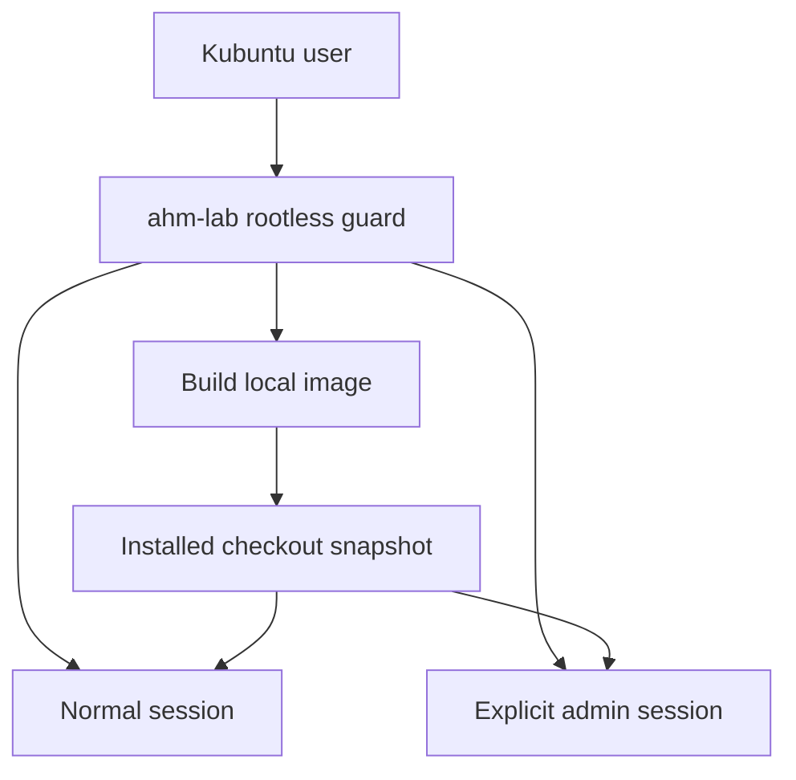

<!-- reports/2026-07-14-container-laboratory.md -->

# Disposable container laboratory report

**Date:** 2026-07-14

**Branch:** `feat/modular-boot-spine`

**Host target:** single-user Kubuntu workstation

**Container userland:** Ubuntu 24.04 LTS

**Primary engine:** rootless Podman

## Outcome

The project now has a repeatable AhMyZSH laboratory that can be opened in
Konsole or the current terminal. The image contains an installed snapshot of
the current checkout. Each launch adds a new writable container layer; exiting
Zsh removes that layer and every experiment made within it.

No real home, checkout, credential agent, container socket, display socket or
device is mounted. This makes the normal failure mode disposable instead of a
mutation of the workstation.

Podman's external `mounts.conf` can inject host paths without a `--mount` or
`--volume` argument. The launcher resolves the effective user, administrator or
distribution file before starting and refuses the session when an active entry
exists.

## Topology and lifecycle

The first launch builds automatically. A later launch reuses the immutable
image layers and starts quickly. `--rebuild` incorporates current checkout
files. `--refresh` additionally pulls the selected Ubuntu tag and bypasses the
build cache. `clean` removes only the named AhMyZSH laboratory image.

## Confinement policy

| Surface | Normal session | Admin session | Online relaxation |
|---|---|---|---|
| Podman engine | rootless required | rootless required | unchanged |
| host mounts | none | none | none |
| container removal | `--rm` | `--rm` | unchanged |
| network | `none` | `none` | isolated default Podman network |
| account | UID/GID 10001 | UID/GID 0 inside user namespace | unchanged |
| capabilities | all dropped | rootless defaults retained for `apt` | unchanged |
| privilege gain | disabled | disabled | disabled |
| PID budget | 512 | 512 | unchanged |
| PID/IPC/cgroup namespaces | explicitly private | explicitly private | unchanged |
| external default mounts | refused | refused | unchanged |

The admin mode is deliberately separate because package-management experiments
need container-root capabilities. Rootless Podman still maps that identity into
the invoking user's user namespace; it is not host root. The admin session does
not gain a host filesystem path and remains offline unless `--online` is also
explicit.

## Image policy

- The fully qualified `docker.io/library/ubuntu:24.04` base avoids ambiguous
  short-name registry resolution.
- Ubuntu 24.04 remains under standard security maintenance through May 2029 and
  is a conservative compatibility base for current Kubuntu machines. The base
  version is a Containerfile build argument so a later deliberate 26.04
  migration does not require redesign.
- Apt uses `--no-install-recommends`; package indexes are removed in the same
  layer.
- A dedicated high non-root UID/GID (10001) owns the active home and source
  copy, avoiding accounts already reserved by the Ubuntu base image.
- The real installer creates both disposable homes. The image build then boots
  the normal shell and rejects a failed module state.
- Matching `.containerignore` and `.dockerignore` policies exclude Git
  internals, the historical virtual environment, generated caches, compiled
  Zsh files and Node dependency trees for both supported builders.
- Fonts are not duplicated into the image because Konsole renders on the host;
  a container-local font cannot configure the host terminal. Lab diagnostics
  therefore report the host-rendered boundary without failing container health.

## Current-practice basis

The design follows the current [Podman run reference](https://docs.podman.io/en/latest/markdown/podman-run.1.html):
rootless containers cannot exceed the launching account's host privileges,
`no-new-privileges` blocks privilege gain, private PID/network namespaces are
the safe direction, and explicit process limits bound accidental forks. The
[Podman build reference](https://docs.podman.io/en/stable/markdown/podman-build.1.html)
defines Containerfile/Dockerfile-compatible builds.

Konsole is invoked according to the [KDE command-line reference](https://docs.kde.org/trunk_kf6/en/konsole/konsole/command-line-options.html),
with `-e` after all Konsole options because it consumes the remaining command
arguments. The base lifecycle is supported by Canonical's [Ubuntu release-cycle
table](https://ubuntu.com/about/release-cycle).

Pull-request CI grants only read access to repository contents and uses the
GitHub source-archive API rather than a checkout action, so no Git credentials
are persisted and the repository's dormant malformed gitlink cannot disrupt
checkout cleanup. It builds the real image, starts it without network or
capabilities, confirms a zero effective capability mask, and runs `ahm doctor`.

## Local verification evidence

| Gate | Result |
|---|---|
| Bash syntax | launcher, installer and tests parse |
| Containerfile policy | non-root user and login-shell command present |
| launcher policy test double | exact Podman/Konsole arguments recorded |
| forbidden host surfaces | no volume/mount; privileged false; private PID/IPC/cgroup namespaces |
| configured default mounts | active `mounts.conf` causes a pre-session refusal |
| explicit relaxations | online changes only network policy; admin changes only account/capability policy |
| automatic rebuild lifecycle | missing image and refresh paths verified |
| full regression suite | 76 passed, 0 failed |
| whitespace validation | clean |
| real rootless-Podman image build and boot | passed in GitHub Actions run 29379476560 |

The implementation workspace did not provide Podman or Docker, so the local
suite intentionally uses a recording engine double. This is not presented as a
substitute for a real image boot; the remote OCI gate below independently built
and started the image.

## Remote OCI verification evidence

[GitHub Actions run 29379476560](https://github.com/LuxciumProject/ahmyzsh/actions/runs/29379476560)
completed successfully against remote commit
`ac1b884ce6eb325437f36bab290be8ff55bb566d` on 2026-07-15 UTC. Its source tree
is byte-for-byte identical to local implementation tree
`6e08864188d828b7a17002a279a2dd3d3945b431`.

| Remote gate | Observed result |
|---|---|
| source acquisition | read-only GitHub source archive extracted successfully |
| isolated regression suite | 76 passed, 0 failed |
| real target engine | Podman 4.9.3 reported rootless operation |
| automatic mount guard | no configured host mounts detected |
| real launcher build | `ahm-lab build` built the official Ubuntu 24.04 image successfully |
| installed boot | `boot=loaded`; all eight active modules loaded |
| degradation state | zero failed modules; native prompt fallback expected without a TTY |
| runtime confinement | effective capability mask `0000000000000000` |
| diagnostics | `ahm doctor` completed successfully inside the offline container |

The preceding [Docker interoperability run](https://github.com/LuxciumProject/ahmyzsh/actions/runs/29379270135)
also passed and measured the matching `.dockerignore` policy: 25.7 MB of build
context, reduced from 48.4 MB without omitting the explorable source snapshot.
Konsole is unavailable on the headless runner as expected; its exact argument
ordering and launcher forwarding are covered by the recording integration test.

Four validation discoveries were corrected before the final green run:

1. The dormant `plugins/tmux/.tmux` gitlink has no matching `.gitmodules` URL,
   so normal checkout cleanup fails even when submodule checkout is disabled.
   CI now consumes a read-only source archive and leaves this legacy repair for
   its own migration stage.
2. The current official Ubuntu 24.04 image reserves GID 1000. The laboratory
   account now uses dedicated UID/GID 10001 instead of assuming a base-image
   account range.
3. `/proc/*/status` separates `CapEff:` with general whitespace. The smoke check
   now parses that format safely and prints each independent assertion before
   enforcing it.
4. Podman reads `.containerignore`, while the CI Docker builder reads
   `.dockerignore`. Matching and regression-tested policies now minimize both
   build paths instead of optimizing only the workstation path.

## Limits and future boundary

Containers share the host kernel. This laboratory protects against accidental
configuration and filesystem changes; a virtual machine remains the correct
boundary for malicious code or kernel-exploit work.

Persistence and host export are intentionally absent. A later extension may add
a named lab home or reviewed export command, but it must remain opt-in and must
not weaken the disposable default. Tmux and custom REPL work can first be tested
inside this lab, then moved into their existing extension boundaries after their
dependencies and boot cost are characterized.
