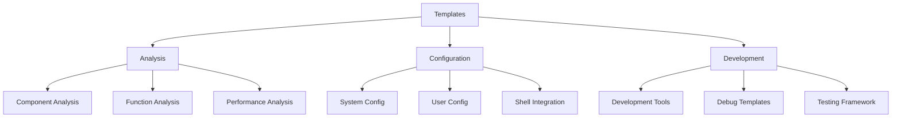
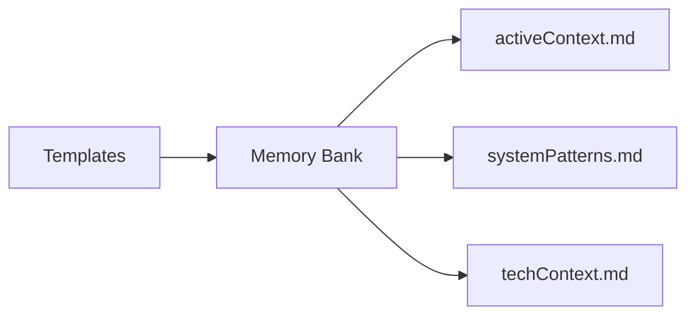

# AHMYZSH Templates

## Template Categories

## Analysis Templates

Structured investigation tools integrated with Sequential Thinking MCP:

### Component Analysis

- Track shell component initialization
- Map dependencies and relationships
- Monitor performance metrics
- Document system patterns

### Function Analysis

- Document function behavior and scope
- Track performance implications
- Map dependencies and relationships
- Monitor error handling

### Investigation Process

- Track ongoing investigations
- Document discoveries and patterns
- Maintain memory bank updates
- Follow sequential thinking approach

### Performance Analysis

- Establish performance baselines
- Identify optimization opportunities
- Plan and track improvements
- Monitor system resources

## Configuration Templates

System and user-level configuration:

### System Configuration (/etc)

- Shell environment setup
- System-wide defaults
- Security policies
- Network configuration

### User Configuration (/home)

- User preferences
- Personal aliases
- Custom functions
- Local overrides

### Shell Integration

- Initialization scripts
- Terminal configurations
- Plugin setups
- Theme installations

## Development Templates

Tools for extending AHMYZSH:

### Development Tools

- Debug configurations
- Testing frameworks
- Performance monitoring
- Code analysis

### Integration Guidelines

- Plugin development
- Theme creation
- Function extensions
- Documentation standards

## Integration with Memory Bank

## Usage Guidelines

1. **Template Selection**
   - Choose appropriate template category
   - Follow template-specific README
   - Maintain documentation standards
   - Update memory bank as needed

2. **Development Process**
   - Start with template
   - Follow guidelines
   - Document changes
   - Update relevant files

3. **Documentation Flow**
   - Use templates for consistency
   - Keep memory bank current
   - Track all changes
   - Maintain relationships

4. **Performance Considerations**
   - Follow optimization templates
   - Monitor system impact
   - Document benchmarks
   - Track improvements

## Best Practices

1. **Template Usage**
   - Start with provided templates
   - Follow naming conventions
   - Maintain structure
   - Document modifications

2. **Documentation**
   - Keep README files updated
   - Document all changes
   - Follow standards
   - Cross-reference related files

3. **Development**
   - Use development templates
   - Follow coding standards
   - Test thoroughly
   - Document new features

4. **Performance**
   - Monitor system impact
   - Follow optimization guides
   - Document benchmarks
   - Track improvements
