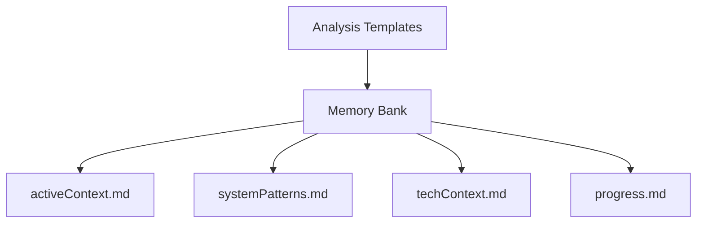

# Analysis Templates

These templates are designed to work with the Sequential Thinking MCP server to provide structured analysis of the AHMYZSH project components.

## Available Templates

1. **component.md**: For analyzing shell components and their interactions
   - Use for major system components
   - Track initialization and dependencies
   - Monitor performance metrics

2. **function.md**: For detailed function analysis
   - Document individual function behavior
   - Track performance implications
   - Map dependencies and relationships

3. **investigation.md**: For tracking ongoing investigations
   - Monitor investigation progress
   - Document discoveries
   - Track memory bank updates

4. **performance.md**: For performance analysis and optimization
   - Baseline measurements
   - Optimization opportunities
   - Implementation planning

## Usage with Sequential Thinking

1. **Start Analysis**:
   ```bash
   # Copy appropriate template
   cp templates/analysis/[template].md analysis/[component-name].md
   ```

2. **Integration with MCP**:
   - Use the sequential thinking tool to break down complex problems
   - Document each thought step in the investigation
   - Track progress in memory bank

3. **Template Selection Guide**:
   - New component investigation → `component.md`
   - Function deep dive → `function.md`
   - Ongoing investigation → `investigation.md`
   - Performance issues → `performance.md`

## Memory Bank Integration

These templates are designed to integrate with the memory bank structure:



## Best Practices

1. **Regular Updates**:
   - Keep analysis documents current
   - Update memory bank after significant findings
   - Track all performance implications

2. **Documentation Flow**:
   - Start with template
   - Document findings
   - Update memory bank
   - Track in progress.md

3. **Performance Tracking**:
   - Use performance.md for baselines
   - Document optimization attempts
   - Track improvements

4. **Investigation Management**:
   - One investigation.md per topic
   - Link related investigations
   - Track dependencies

## Workflow Integration

Templates support our defined investigation patterns from .clinerules:

1. **File Analysis**
   - Use component.md template
   - Track dependencies
   - Map initialization

2. **Function Mapping**
   - Use function.md template
   - Document relationships
   - Track performance

3. **Branch Management**
   - Use investigation.md
   - Track progress
   - Document findings
