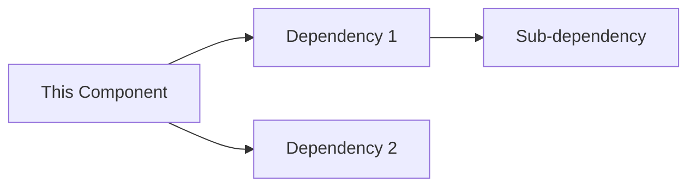

# Component Analysis: [Component Name]

## 1. Initial Context

- **Level**: [0-3]
- **File Location**: [path]
- **Primary Purpose**: [description]

## 2. Dependencies

## 3. Initialization Sequence

- **Load Order**: [number]
- **Prerequisites**: [list]
- **Post-conditions**: [list]

## 4. Performance Metrics

- **Load Time**: [measurement]
- **Resource Usage**: [details]
- **Optimization Status**: [current/potential]

## 5. Investigation Notes

- [ ] Function relationships mapped
- [ ] Performance bottlenecks identified
- [ ] Optimization opportunities noted
- [ ] Documentation updated

## 6. Memory Bank Integration

- **Updates Required**:
  - [ ] activeContext.md
  - [ ] systemPatterns.md
  - [ ] techContext.md
  - [ ] progress.md

## 7. Next Actions

1. [Action 1]
2. [Action 2]
3. [Action 3]

## 8. Related Components

- [Component 1] - [Relationship]
- [Component 2] - [Relationship]
