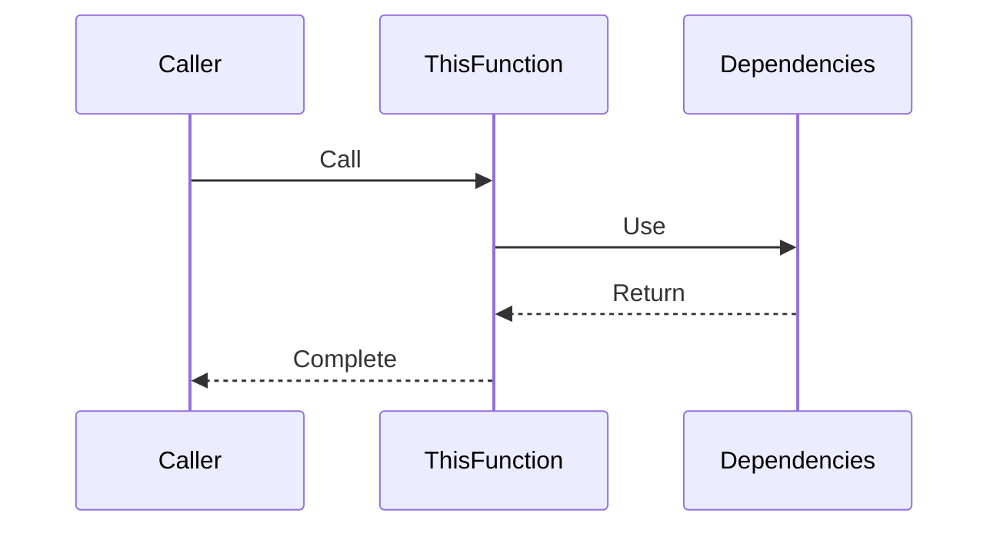

# Function Analysis: [Function Name]

## 1. Function Overview

- **Purpose**: [description]
- **Location**: [file:line]
- **Scope**: [global/local]
- **Type**: [sourced/defined/alias]

## 2. Execution Flow

## 3. Performance Profile

- **Average Runtime**: [measurement]
- **Memory Impact**: [details]
- **Call Frequency**: [stats]
- **Dependencies Count**: [number]

## 4. Dependencies

- **Required Functions**:
  - [function1] - [purpose]
  - [function2] - [purpose]
- **Environment Variables**:
  - [var1] - [purpose]
  - [var2] - [purpose]

## 5. Error Handling

- **Edge Cases**:
  - [case1] - [handling]
  - [case2] - [handling]
- **Recovery Mechanisms**: [description]

## 6. Optimization Status

- [ ] Code reviewed
- [ ] Performance measured
- [ ] Dependencies optimized
- [ ] Documentation updated
- [ ] Error handling verified

## 7. Documentation Updates

- **Memory Bank Files**:
  - [ ] systemPatterns.md - [changes needed]
  - [ ] techContext.md - [changes needed]
- **.clinerules Updates**:
  - [ ] New patterns
  - [ ] Performance notes

## 8. Testing Notes

- **Test Cases**:
  - [ ] Basic functionality
  - [ ] Edge cases
  - [ ] Performance benchmarks
- **Coverage**: [percentage/description]
