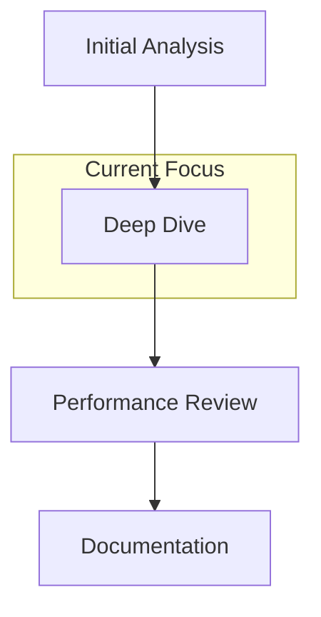

# Investigation: [Topic]

## 1. Current Status

- **Phase**: [Planning/In Progress/Review]
- **Priority**: [High/Medium/Low]
- **Completion**: [0-100%]
- **Last Updated**: [date]

## 2. Sequential Thinking Steps

## 3. Discoveries

- **Patterns Found**:
  - [Pattern 1]: [description]
  - [Pattern 2]: [description]
- **Issues Identified**:
- **Optimization Opportunities**:
  - [Opportunity 1]: [potential gain]
  - [Opportunity 2]: [potential gain]

## 4. Investigation Path

- **Completed Steps**:
  1. [Step 1]
  2. [Step 2]
- **Current Focus**:
  - [Current task]
  - [Expected outcome]
- **Next Steps**:
  - [ ] [Task 1]
  - [ ] [Task 2]
  - [ ] [Task 3]

## 5. Dependencies

- **Required Components**:
  - [Component 1]
  - [Component 2]
- **Related Investigations**:
  - [Investigation 1] - [relationship]
  - [Investigation 2] - [relationship]

## 6. Memory Bank Updates

- **activeContext.md**:
  - [ ] [Update 1]
  - [ ] [Update 2]
- **systemPatterns.md**:
  - [ ] [Pattern 1]
  - [ ] [Pattern 2]
- **progress.md**:
  - [ ] [Progress note 1]
  - [ ] [Progress note 2]
- **techContext.md**:
  - [ ] [Technical update 1]
  - [ ] [Technical update 2]

## 7. Performance Implications

- **Current Metrics**:
- **Target Improvements**:

## 8. Risk Assessment

- **Potential Issues**:
- **Safeguards**:
  - [Safeguard 1]
  - [Safeguard 2]
