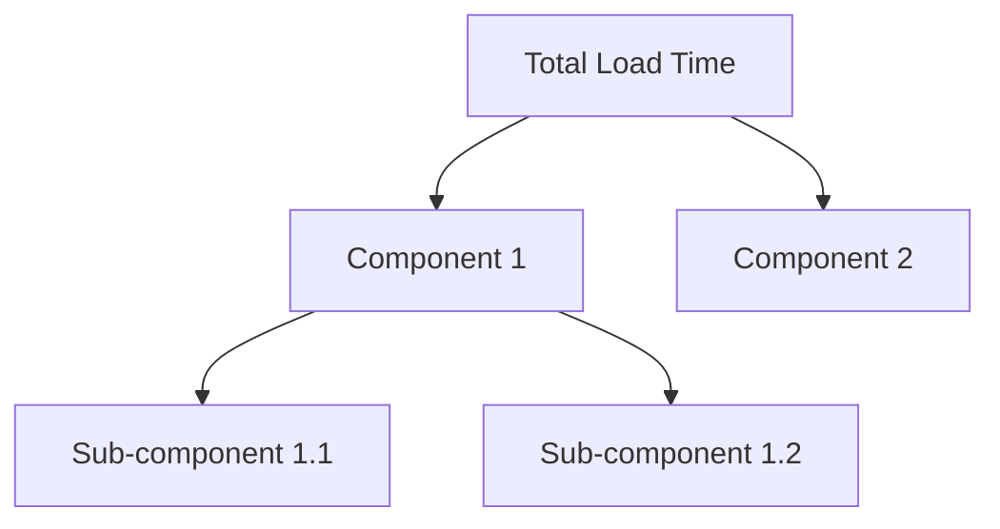

# Performance Analysis: [Feature/Component]

## 1. Metrics Overview

## 2. Baseline Measurements

- **Total Load Time**: [measurement]
- **Memory Usage Peak**: [measurement]
- **CPU Utilization**: [percentage]
- **I/O Operations**: [count]

## 3. Component Breakdown

- **Component 1**:
  - Load Time: [time]
  - Resource Usage: [details]
  - Dependencies: [count]
  - Bottlenecks: [list]

- **Component 2**:
  - Load Time: [time]
  - Resource Usage: [details]
  - Dependencies: [count]
  - Bottlenecks: [list]

## 4. Optimization Opportunities

- **High Priority**:
  - [ ] [Improvement 1] - [Expected Impact]
  - [ ] [Improvement 2] - [Expected Impact]

- **Medium Priority**:
  - [ ] [Improvement 3] - [Expected Impact]
  - [ ] [Improvement 4] - [Expected Impact]

- **Low Priority**:
  - [ ] [Improvement 5] - [Expected Impact]
  - [ ] [Improvement 6] - [Expected Impact]

## 5. Implementation Plan

- **Phase 1: Initial Optimizations**
  - [ ] [Task 1]
  - [ ] [Task 2]
  - Expected Improvement: [percentage]

- **Phase 2: Deep Optimizations**
  - [ ] [Task 3]
  - [ ] [Task 4]
  - Expected Improvement: [percentage]

## 6. Dependencies Impact

- **Critical Path**:
  1. [Step 1] - [Time]
  2. [Step 2] - [Time]
  3. [Step 3] - [Time]

- **Parallel Operations**:
  - [Operation 1] - [Time]
  - [Operation 2] - [Time]

## 7. Memory Bank Updates

- **systemPatterns.md**:
  - [ ] Document performance patterns
  - [ ] Update optimization strategies

- **techContext.md**:
  - [ ] Update performance baselines
  - [ ] Document technical constraints

## 8. Monitoring Plan

- **Metrics to Track**:
  - [ ] [Metric 1]
  - [ ] [Metric 2]

- **Alert Thresholds**:
  - [Metric 1]: [threshold]
  - [Metric 2]: [threshold]

## 9. Risk Assessment

- **Potential Issues**:

- **Fallback Plan**:
  - [Strategy 1]
  - [Strategy 2]
